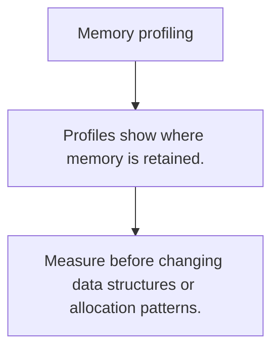

# PR.3 Memory profiling

## Mission

Learn how heap profiles reveal where memory is retained and where allocation pressure is coming from.

## Prerequisites

- none

## Mental Model

A memory profile is a map of where bytes are being kept or allocated, not just a count of total memory used.

## Visual Model



## Machine View

Heap profiling samples allocation sites so you can trace memory cost back to code paths.

## Run Instructions

```bash
go run ./08-quality-test/01-quality-and-performance/profiling/3-memory-profiling
```

## Code Walkthrough

### Profiles show where memory is retained.

Profiles show where memory is retained.

### Allocation rate and live heap are related but differen

Allocation rate and live heap are related but different signals.

### Measure before changing data structures or allocation 

Measure before changing data structures or allocation patterns.

## Try It

1. Change one of the example inputs and rerun the lesson.
2. Explain which boundary the lesson is trying to make explicit.
3. Describe how you would apply PR.3 in a small service or tool.

## ⚠️ In Production

Memory tuning starts with visibility. Without a profile, you are usually guessing at the wrong thing.

## 🤔 Thinking Questions

1. What problem does this topic solve?
2. What breaks if this boundary is handled implicitly instead of explicitly?
3. Where would you expect to use this topic in production Go code?

## Next Step

Continue to `PR.4`.
