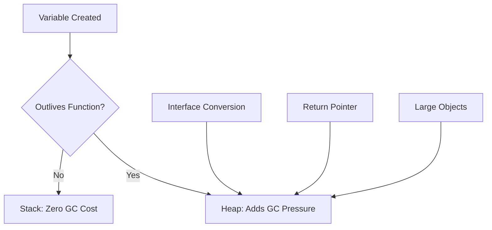

# PR.4 Escape Analysis

## Mission

Master the "Why" behind memory allocations. Learn how the Go compiler decides whether a variable lives on the **Stack** (fast, free) or the **Heap** (slower, GC cost). Understand how to use compiler flags to audit these decisions and optimize your hot paths.

## Prerequisites

- PR.3 Memory Profiling
- Understanding of Pointers (Section 02).

## Mental Model

Think of Escape Analysis as **A Guest List at a Party**.

1. **The Function**: A function call is a party.
2. **The Stack**: If a variable is born at the party and stays there until the party ends (the function returns), it lives on the Stack. When the party is over, the room is cleaned instantly.
3. **The Escape**: If a variable needs to go home with a guest (be returned to the caller) or join another party (be shared with a goroutine), it must "Escape" to the Heap.
4. **The Heap**: The Heap is a hotel. It's more expensive, and a janitor (the GC) has to come by later to check if the room is still occupied.

## Visual Model



## Machine View

- **Stack**: Very fast allocation (just moving a pointer). Automatic cleanup. No GC involved.
- **Heap**: Slower allocation. Requires tracking by the Garbage Collector.
- **`-gcflags="-m"`**: This is the magic compiler flag. It tells you exactly what the compiler is thinking. "m" stands for "optimization decisions."

## Run Instructions

```bash
# Check escape analysis decisions for this directory
go build -gcflags="-m" ./08-quality-test/01-quality-and-performance/profiling/4-escape-analysis
```

## Code Walkthrough

### Returning a Pointer
Shows how `return &x` forces `x` to escape to the heap because the value must exist after the function finishes.

### Interface Conversion
Shows how passing a concrete type to an `interface{}` argument (like `fmt.Println(x)`) often causes `x` to escape, as the compiler can't always prove how the interface will be used.

## Try It

1. Run the `go build -gcflags="-m"` command. Look for lines that say `escapes to heap`.
2. Can you find a variable that *doesn't* escape?
3. Modify the code to return a **Value** instead of a **Pointer** (`return x` instead of `return &x`). Run the check again. Does it still escape?

## In Production
**Don't obsess over every escape.** Escape analysis is a compiler optimization. Sometimes the heap is the correct place for data. However, in "Hot Paths" (code that runs millions of times), reducing escapes can dramatically reduce CPU usage by giving the Garbage Collector less work to do.

## Thinking Questions
1. Why does `fmt.Println` almost always cause its arguments to escape?
2. Is a pointer always slower than a value?
3. How can a very large array on the stack cause a "Stack Overflow"?

## Next Step

Now that you understand the machine's decisions, learn how to use benchmarks to prove your optimizations. Continue to [PR.5 Benchmark-Driven Development](../5-benchmark-driven-development).
