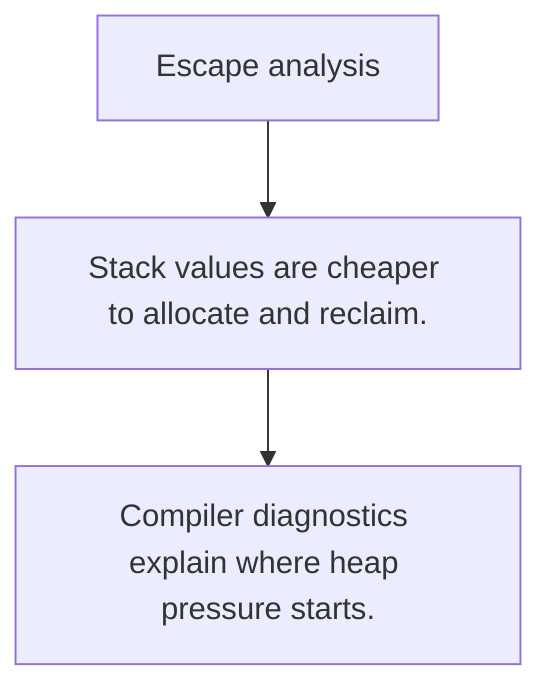

# PR.4 Escape analysis

## Mission

Learn how the compiler decides whether values stay on the stack or escape to the heap.

## Prerequisites

- PR.3

## Mental Model

Escape analysis is the compiler's answer to one question: does this value need to outlive the current stack frame?

## Visual Model



## Machine View

Pointers, interface conversions, closures, and returned references often influence whether the compiler must move data to the heap.

## Run Instructions

```bash
go run ./08-quality-test/01-quality-and-performance/profiling/4-escape-analysis
```

## Code Walkthrough

### Stack values are cheaper to allocate and reclaim.

Stack values are cheaper to allocate and reclaim.

### Escapes often happen because a value must outlive the 

Escapes often happen because a value must outlive the current function.

### Compiler diagnostics explain where heap pressure start

Compiler diagnostics explain where heap pressure starts.

## Try It

1. Change one of the example inputs and rerun the lesson.
2. Explain which boundary the lesson is trying to make explicit.
3. Describe how you would apply PR.4 in a small service or tool.

## ⚠️ In Production

Escape analysis explains many allocation surprises, especially in helper-heavy code or tight loops.

## 🤔 Thinking Questions

1. What problem does this topic solve?
2. What breaks if this boundary is handled implicitly instead of explicitly?
3. Where would you expect to use this topic in production Go code?

## Next Step

Continue to `PR.5`.
