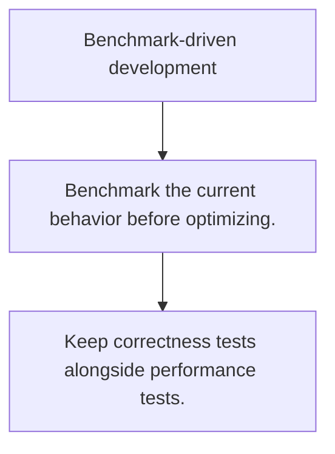

# PR.5 Benchmark-driven development

## Mission

Learn how benchmarks protect performance discussions from guesswork by measuring before and after changes.

## Prerequisites

- PR.4

## Mental Model

Benchmarks turn performance from opinion into evidence.

## Visual Model



## Machine View

The testing package measures repeated executions so small code changes can be compared with real numbers.

## Run Instructions

```bash
go test ./08-quality-test/01-quality-and-performance/profiling/5-benchmark-driven-development
```

## Code Walkthrough

### Benchmark the current behavior before optimizing.

Benchmark the current behavior before optimizing.

### Use stable inputs and report allocations with the benc

Use stable inputs and report allocations with the benchmark.

### Keep correctness tests alongside performance tests.

Keep correctness tests alongside performance tests.

## Try It

1. Change one of the example inputs and rerun the lesson.
2. Explain which boundary the lesson is trying to make explicit.
3. Describe how you would apply PR.5 in a small service or tool.

## ⚠️ In Production

Benchmark work is valuable only when the measured scenario matches a real hot path or meaningful workload.

## 🤔 Thinking Questions

1. What problem does this topic solve?
2. What breaks if this boundary is handled implicitly instead of explicitly?
3. Where would you expect to use this topic in production Go code?

## Next Step

Continue to `PR.6`.
