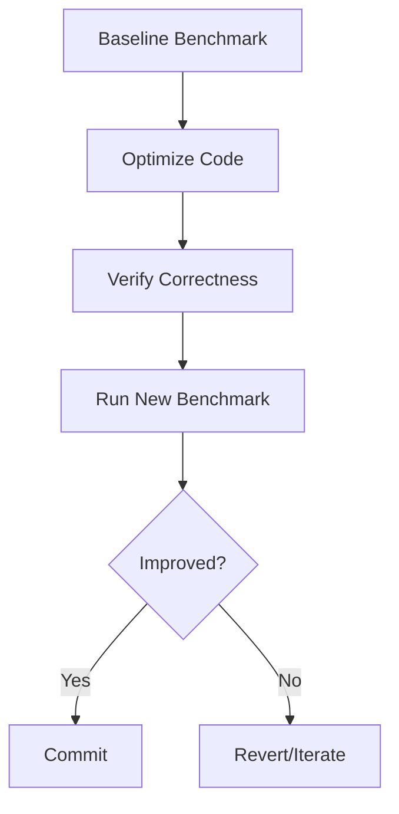

# PR.5 Benchmark-Driven Development

## Mission

Master the "Measure-Optimize-Verify" cycle. Learn how to use benchmarks to prove that an optimization actually works, ensure that performance fixes don't break correctness, and understand how to use `benchstat` to compare results statistically.

## Prerequisites

- PR.4 Escape Analysis
- TE.4 Benchmarking

## Mental Model

Think of Benchmark-Driven Development as **A Racing Pit Crew**.

1. **The Lap Time**: Before you change anything on the car (code), you run a lap to get a baseline time (Initial Benchmark).
2. **The Tweak**: You make a specific optimization (e.g., pre-allocating a slice).
3. **The Verification**: You run another lap. If the time is faster, the tweak stays. If it's slower or the same, you revert.
4. **The Inspect**: You check the engine temperature (Correctness Tests) to make sure your fast car hasn't lost its brakes.

## Visual Model



## Machine View

- **`ns/op`**: The time it takes to run one iteration.
- **`benchstat`**: A separate Go tool that compares two sets of benchmark results and tells you if the difference is "statistically significant" (Delta %) or just noise.
- **Side Effects**: Always ensure your optimized code still passes the original unit tests. A fast function that returns the wrong answer is a bug, not an optimization.

## Run Instructions

```bash
# Run benchmarks and save result to 'old.txt'
go test -bench=. -benchmem -count=5 ./08-quality-test/01-quality-and-performance/profiling/5-benchmark-driven-development > old.txt

# (After making changes) Run again and save to 'new.txt'
# go test -bench=. -benchmem -count=5 ./... > new.txt
# benchstat old.txt new.txt
```

## Code Walkthrough

### The "Naive" Implementation
A function that performs a common task (like joining strings) in a sub-optimal way.

### The "Optimized" Implementation
The same task performed using more efficient techniques discovered in earlier lessons (e.g., `strings.Builder`).

## Try It

1. Run the benchmarks and note the `ns/op`.
2. Modify the code to use a `sync.Pool` for the temporary buffers.
3. Rerun the benchmarks. Did the memory usage (`B/op`) go down? Did the speed improve?

## In Production
**Don't "Micro-Optimize" everything.** Most of your code is not in a "Hot Path." Spending hours saving 5 nanoseconds in a function that runs once a day is a waste of engineering time. Focus your BDD efforts on the 1% of code that consumes 90% of the resources.

## Thinking Questions
1. Why do we run benchmarks multiple times (using `-count`)?
2. What is the danger of optimizing for speed at the cost of code readability?
3. How can you automate performance regression testing in a CI/CD pipeline?

## Next Step

Next: `PR.6` -> `08-quality-test/01-quality-and-performance/profiling/6-memory-layout`

Open `08-quality-test/01-quality-and-performance/profiling/6-memory-layout/README.md` to continue.
