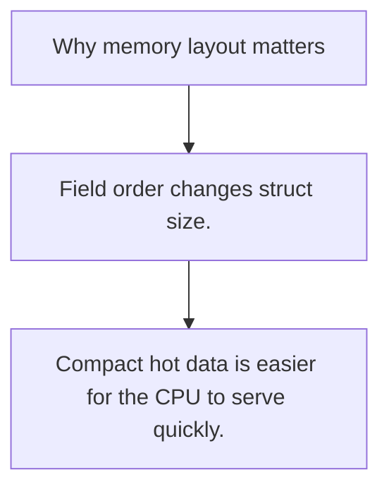

# PR.6 Why memory layout matters

## Mission

Understand why field order and access pattern influence cache behavior and practical cost.

## Prerequisites

- PR.5

## Mental Model

The CPU wants data that is read together to live close together.

## Visual Model



## Machine View

Alignment and padding change how much data fits into the same cache line.

## Run Instructions

```bash
go run ./08-quality-test/01-quality-and-performance/profiling/6-memory-layout
```

## Code Walkthrough

### Field order changes struct size.

Field order changes struct size.

### Cache locality changes traversal cost.

Cache locality changes traversal cost.

### Compact hot data is easier for the CPU to serve quickl

Compact hot data is easier for the CPU to serve quickly.

## Try It

1. Change one of the example inputs and rerun the lesson.
2. Explain which boundary the lesson is trying to make explicit.
3. Describe how you would apply PR.6 in a small service or tool.

## ⚠️ In Production

Layout tuning is a hot-path tool, not a replacement for good algorithms.

## 🤔 Thinking Questions

1. What problem does this topic solve?
2. What breaks if this boundary is handled implicitly instead of explicitly?
3. Where would you expect to use this topic in production Go code?

## Next Step

Use this lesson as a reference surface before moving to the next track in the section.
