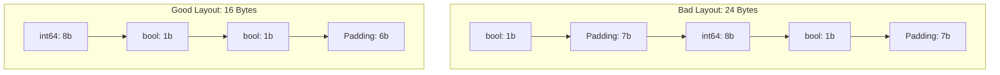

# PR.6 Memory Layout

## Mission

Understand how the physical layout of data in memory impacts performance. Learn about **Struct Padding**, **Alignment**, and **Cache Locality**. Master the art of organizing your data structures to minimize memory footprint and maximize CPU cache efficiency.

## Prerequisites

- PR.5 Benchmark-Driven Development

## Mental Model

Think of Memory Layout as **Packing a Suitcase**.

1. **The Items**: Your struct fields are items of different sizes (a 1-byte sock, an 8-byte laptop).
2. **The Rule**: The machine wants items to start at specific intervals (Alignment). An 8-byte item wants to start at an address divisible by 8.
3. **The Padding**: If you put a sock (1 byte) followed by a laptop (8 bytes), the machine leaves 7 bytes of empty space (Padding) to make the laptop align correctly.
4. **The Goal**: Pack the suitcase tightly so you can fit more in (smaller memory footprint) and pull items out faster (Cache Locality).

## Visual Model



## Machine View

- **Sizeof**: Use `unsafe.Sizeof(x)` to see how many bytes a struct actually occupies.
- **Cache Lines**: The CPU doesn't read 1 byte at a time; it reads "Cache Lines" (usually 64 bytes). If your "Hot Data" is spread across multiple cache lines because of bad padding, the CPU has to work twice as hard.
- **Field Reordering**: Moving larger fields to the top of the struct often reduces the total padding required.

## Run Instructions

```bash
# Run the demo to see struct sizes and timing differences
go run ./08-quality-test/01-quality-and-performance/profiling/6-memory-layout
```

## Code Walkthrough

### Struct Alignment Demo
Compares two structs with the same fields but different orders. Shows the `unsafe.Sizeof` difference.

### Cache Locality Demo
Compares traversing a 2D slice "Row-by-Row" vs "Column-by-Column." Row-by-Row is significantly faster because it follows the way the memory is physically laid out, maximizing cache hits.

## Try It

1. Run the code. How many bytes were saved by reordering the struct?
2. Modify the `Cache Locality` test to use a larger slice. Watch the performance difference grow exponentially.
3. (Advanced) Use `reflect.TypeOf(x).Field(i).Offset` to see exactly where each field starts in memory.

## In Production
**Don't reorder every struct.** It can make code harder to read. Save this optimization for "Heavy" structs that you store in large slices (millions of elements) or for fields that are accessed millions of times per second in a tight loop.

## Thinking Questions
1. Why does the CPU care about alignment?
2. What is a "Cache Miss," and why is it expensive?
3. Should you group fields by "Meaning" or by "Size"?

## Next Step

Congratulations! You've completed Section 08: Quality & Testing. You now have the tools to build fast, correct, and efficient Go systems. Move to [Section 09: Application Architecture](../../../../09-architecture) to start putting it all together.
