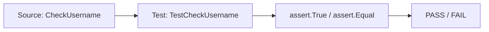

# TE.1 Unit Testing

## Mission

Learn how to write unit tests in Go using the built-in `testing` package. Understand test file conventions, function signatures, and assertion patterns with `testify/assert`.

## Prerequisites

None — this is the entry point to the Testing track.

## Mental Model

Think of a unit test as **A Recipe Checker**. Each test function is one recipe step: set up ingredients (arrange), perform the action (act), check the result (assert).

## Visual Model



## Machine View

- Go's `testing` package scans all `*_test.go` files in a package.
- Functions starting with `Test` and taking `*testing.T` are executed by `go test`.
- Each test runs in the same process — no forking. Tests can use `t.Parallel()` to opt into concurrent execution.

## Run Instructions

```bash
go test ./08-quality-test/01-quality-and-performance/testing/01-unit-testing
```

## Code Walkthrough

The source file defines two functions:
- `CheckUsername` validates username length and reserved words.
- `Login` wraps `CheckUsername` with error handling.

The test file demonstrates:
- Basic unit test with a single case.
- Table-driven test with multiple cases (preview; TE.2 covers this in depth).
- Multi-return and error testing via `TestLogin`.

## Try It

1. Run `go test -v` to see each test case printed by name.
2. Change the `CheckUsername` function to accept 5-character minimums. Which test breaks?
3. Add a new test case for an empty username.

## In Production

Unit tests are the foundation of Go reliability. Every exported function in a production codebase should have at least one basic test. Table-driven tests are the standard pattern for covering edge cases without duplication.

## Thinking Questions

1. Why does Go require test files to end with `_test.go`?
2. What happens if a test function takes `*testing.T` but never calls any method on it?
3. How would you test a function that writes to `os.Stdout`?

## Next Step

Next: `TE.2` -> [`08-quality-test/01-quality-and-performance/testing/02-table-driven-tests`](../02-table-driven-tests/README.md)
