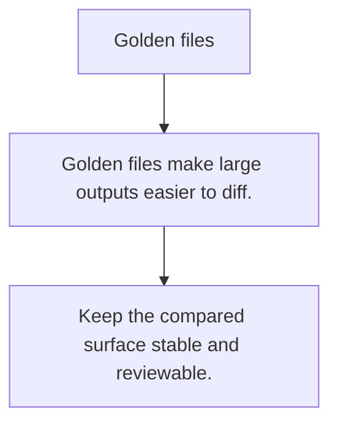

# TE.10 Golden files

## Mission

Learn how golden files keep large textual outputs reviewable without hard-coding long strings inside tests.

## Prerequisites

- TE.9

## Mental Model

A golden file is a checked-in expected output that the test compares against generated output.

## Visual Model



## Machine View

The test becomes about stable output shape rather than line-noise in the test source.

## Run Instructions

```bash
go test ./08-quality-test/01-quality-and-performance/testing/10-golden-files
```

## Code Walkthrough

### Golden files make large outputs easier to diff.

Golden files make large outputs easier to diff.

### Update goldens intentionally, not automatically by def

Update goldens intentionally, not automatically by default.

### Keep the compared surface stable and reviewable.

Keep the compared surface stable and reviewable.

## Try It

1. Change one of the example inputs and rerun the lesson.
2. Explain which boundary the lesson is trying to make explicit.
3. Describe how you would apply TE.10 in a small service or tool.

## ⚠️ In Production

Golden files are useful when the output is human-reviewed and small output changes should be deliberate.

## 🤔 Thinking Questions

1. What problem does this topic solve?
2. What breaks if this boundary is handled implicitly instead of explicitly?
3. Where would you expect to use this topic in production Go code?

## Next Step

Use this lesson as a reference surface before moving to the next track in the section.
