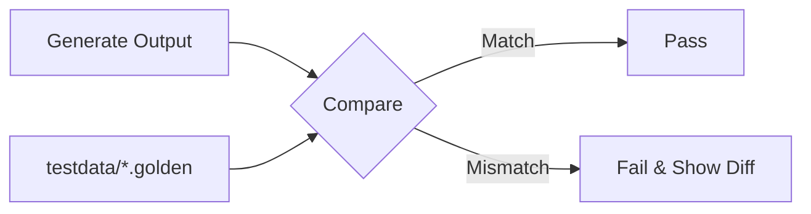

# TE.10 Golden Files

## Mission

Master the "Golden File" pattern to test functions that produce large or complex outputs (like JSON, HTML, or large structs). Learn how to avoid hard-coding massive strings in your test files and how to manage snapshots of "correct" behavior that can be easily reviewed and updated.

## Prerequisites

- TE.9 Integration Testing

## Mental Model

Think of Golden Files as **A Reference Photo**.

1. **The Painting**: Your code produces a complex masterpiece (a 1,000-line JSON response).
2. **The Photo**: Instead of describing every pixel in your test code, you take a "Golden Photo" of the masterpiece and save it to a file (`response.json.golden`).
3. **The Comparison**: Every time you run the test, you paint a new version and compare it to the photo.
4. **The Update**: If you intentionally change the style of the painting, you just take a new photo (`go test -update`).

## Visual Model



## Machine View

- **`testdata/` folder**: Go's testing tool ignores this folder, making it the perfect place to store golden files.
- **Flags**: Often, Go engineers add a custom flag (like `-update`) to their tests to overwrite the golden files with the current output when behavior intentionally changes.
- **Bytes comparison**: Most golden file tests use `bytes.Equal` or a string diff tool to show exactly what changed.

## Run Instructions

```bash
# Run tests and compare output to goldens
go test -v ./08-quality-test/01-quality-and-performance/testing/10-golden-files
```

## Code Walkthrough

### The `testdata` Pattern
Shows how to read a file from the `testdata` directory and compare its contents against the actual result of a function.

### Handling Diffs
Demonstrates how to provide a human-readable diff (using a library or simple logic) when the output doesn't match the golden file, making it easy to see what broke.

## Try It

1. Modify the `main.go` code to change one field in the output. Run the test and watch it fail.
2. Read the error message. Does it clearly show what changed?
3. (Advanced) Implement an `-update` flag in the test to automatically refresh the golden file.

## In Production
Golden files are a double-edged sword. They are very easy to write, but they can lead to "Lazy Testing" where developers just update the golden file without actually checking if the new output is correct. **Always review the diff** before updating a golden file. They are best suited for stable outputs where any change is significant.

## Thinking Questions
1. Why are golden files better than hard-coded strings for large outputs?
2. How do you handle "Non-deterministic" data (like timestamps or random IDs) in a golden file?
3. Should golden files be checked into Version Control (Git)?

## Next Step

You've mastered the Testing Track! Now, let's look at the "What" and "How" of performance. Move to the [Profiling Track](../../profiling).
