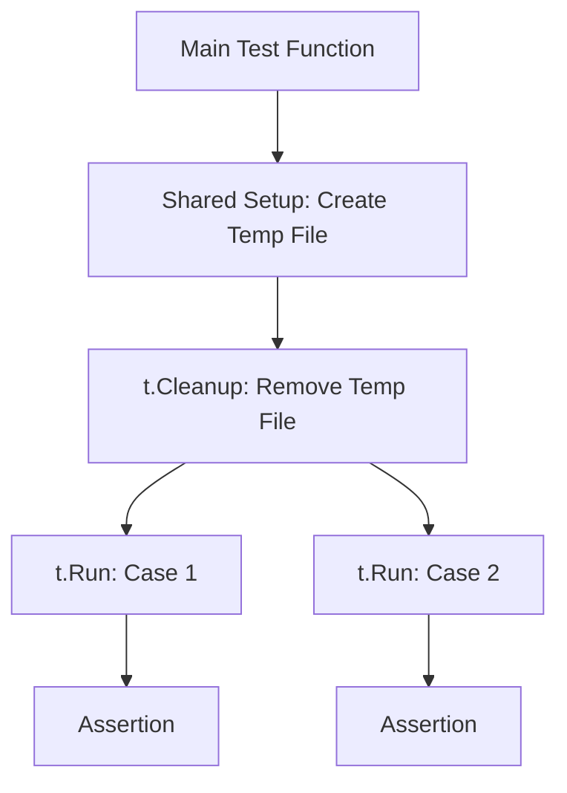

# TE.5 Sub-tests and t.Cleanup

## Mission

Learn how to structure complex tests using sub-tests (`t.Run`) and manage resources reliably with `t.Cleanup`. Master the pattern of isolating test cases while sharing setup logic without leaks.

## Prerequisites

- TE.1 Unit Testing

## Mental Model

Think of Sub-tests and Cleanup as **A Lab Workspace**.

1. **The Workspace**: You have a shared table (the main `Test` function).
2. **The Experiment**: You run multiple independent trials (sub-tests) on that table.
3. **The Scoping**: Each trial gets its own name and result, but they might share the same equipment.
4. **The Janitor**: `t.Cleanup` is the rule that says "whenever this specific trial (or the whole table) is done, put the equipment back." It runs even if the experiment explodes (test fails).

## Visual Model



## Machine View

- **`t.Run`**: Spawns a sub-test. Each sub-test can be run independently using `go test -run TestMain/SubCase`.
- **`t.Cleanup`**: Registers a function to be called when the test (and all its sub-tests) finishes. It is superior to `defer` because it works correctly with `t.Parallel()` and ensures cleanup happens even if you call `t.Fatalf()` (which skips `defer` in the same function scope but not `t.Cleanup`).

## Run Instructions

```bash
# Run tests and observe the hierarchical output
go test -v ./08-quality-test/01-quality-and-performance/testing/5-sub-tests-and-cleanup
```

## Code Walkthrough

### `t.Run` for Iteration
Shows how to loop over a table of cases and give each one a clear identity. This prevents one failure from hiding other potential bugs.

### `t.Cleanup` for Safety
Demonstrates creating a temporary resource (like a database connection or file) and ensuring it is closed/deleted regardless of test success or failure.

## Try It

1. Add a second sub-test to `main_test.go` that tests a different edge case.
2. In the cleanup function, add a `fmt.Println("Cleaning up...")` and run with `-v` to see exactly when it executes.
3. Compare `t.Cleanup` behavior with a `defer` by intentionaly failing the test with `t.Fatalf`.

## In Production
Use `t.Cleanup` for any resource that needs to be released (ports, temp files, mocks). In large suites, failing to clean up resources can lead to "flaky tests" where tests pass in isolation but fail when run together because of leftover state.

## Thinking Questions
1. Why is `t.Cleanup` preferred over `defer` for test teardown?
2. How do sub-tests help when debugging a failure in a CI pipeline?
3. If you have a `t.Cleanup` in the main test function and another in a sub-test, in what order do they run?

## Next Step

After mastering test structure, learn how to find bugs you didn't even know were possible. Continue to [TE.6 Fuzz Testing](../6-fuzz-testing).
