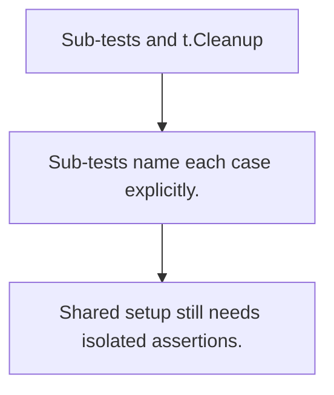

# TE.5 Sub-tests and t.Cleanup

## Mission

Learn how sub-tests scope assertions and how t.Cleanup keeps test teardown tied to the test that created the resource.

## Prerequisites

- none

## Mental Model

Sub-tests let one test file express many related cases without losing names or isolation.

## Visual Model



## Machine View

The testing package tracks cleanup callbacks so resources are released even when a test fails early.

## Run Instructions

```bash
go test ./08-quality-test/01-quality-and-performance/testing/5-sub-tests-and-cleanup
```

## Code Walkthrough

### Sub-tests name each case explicitly.

Sub-tests name each case explicitly.

### t.Cleanup binds teardown to setup.

t.Cleanup binds teardown to setup.

### Shared setup still needs isolated assertions.

Shared setup still needs isolated assertions.

## Try It

1. Change one of the example inputs and rerun the lesson.
2. Explain which boundary the lesson is trying to make explicit.
3. Describe how you would apply TE.5 in a small service or tool.

## ⚠️ In Production

Good test structure makes failures local and teardown automatic.

## 🤔 Thinking Questions

1. What problem does this topic solve?
2. What breaks if this boundary is handled implicitly instead of explicitly?
3. Where would you expect to use this topic in production Go code?

## Next Step

Continue to `TE.6`.
