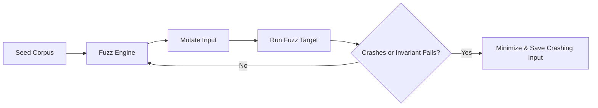

# TE.6 Fuzz Testing

## Mission

Master Go Fuzzing to discover edge cases that manual testing misses. Learn how to write `FuzzXxx(f *testing.F)` functions, provide seed corpora, and interpret crashing inputs to harden your code against unexpected data.

## Prerequisites

- TE.5 Sub-tests and Cleanup
- Understanding of basic Go types and properties.

## Mental Model

Think of Fuzzing as **A Digital Toddler with a Sledgehammer**.

1. **The Seed**: You give the toddler some basic blocks (valid inputs like "hello").
2. **The Mutation**: The toddler takes those blocks and starts smashing them, stretching them, and turning them into weird shapes (invalid bytes, huge strings, empty inputs).
3. **The Invariant**: You set a rule: "No matter what the toddler does, the house shouldn't fall down" (the function shouldn't crash or return an impossible result).
4. **The Discovery**: If the house falls, the toddler shows you exactly which weird shape caused it.

## Visual Model



## Machine View

- **`testing.F`**: The fuzzing entry point.
- **`f.Add()`**: Adds "seeds" to the corpus. These guide the fuzzer on the general shape of valid data.
- **`f.Fuzz()`**: The main loop. It generates random bytes/values and passes them to your test.
- **Coverage-Guided**: The Go fuzzing engine is smart. It tracks which code paths are hit by different inputs and prioritizes mutations that explore new paths.

## Run Instructions

```bash
# Run the fuzz test normally (uses seed corpus only)
go test ./08-quality-test/01-quality-and-performance/testing/6-fuzz-testing

# Run the actual fuzzer (will run until you stop it with Ctrl+C)
go test -fuzz=Fuzz ./08-quality-test/01-quality-and-performance/testing/6-fuzz-testing
```

## Code Walkthrough

### `FuzzReverse`
Shows how a simple "Reverse String" function can fail when handling multi-byte UTF-8 characters (like emojis or non-English letters). The fuzzer will quickly find an input that breaks the assumption that `len(s)` is the number of characters.

## Try It

1. Run the fuzzer on the provided example. How long does it take to find a crash?
2. Once it crashes, look in the `testdata/fuzz` directory. You will see a file containing the exact bytes that caused the failure.
3. Fix the code to handle the failing case and rerun the fuzzer to prove it's fixed.

## In Production
Fuzzing is critical for **Security Boundaries**. Any function that parses data from the internet (JSON, XML, Custom Protocols) must be fuzzed. A single unhandled edge case can lead to a Denial of Service (DoS) attack or memory corruption.

## Thinking Questions
1. Why is it better to test "Invariants" (e.g., `Reverse(Reverse(s)) == s`) rather than exact outputs in a fuzz test?
2. What is the difference between the "Seed Corpus" and the "Generated Corpus"?
3. When should you stop a fuzzing run?

## Next Step

Next: `TE.7` -> `08-quality-test/01-quality-and-performance/testing/7-interfaces-for-testability`

Open `08-quality-test/01-quality-and-performance/testing/7-interfaces-for-testability/README.md` to continue.
