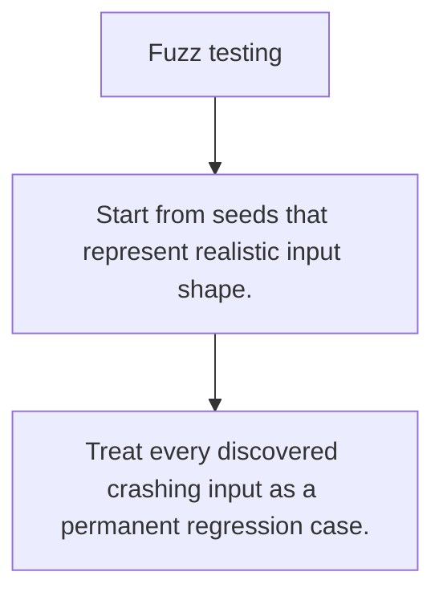

# TE.6 Fuzz testing

## Mission

Learn how fuzzing explores unexpected inputs and captures crashing or misbehaving cases automatically.

## Prerequisites

- TE.5

## Mental Model

Fuzzing is structured curiosity: keep mutating inputs until the boundary breaks or an invariant fails.

## Visual Model



## Machine View

The fuzz engine keeps and replays interesting inputs that violate your assertions.

## Run Instructions

```bash
go test ./08-quality-test/01-quality-and-performance/testing/6-fuzz-testing
```

## Code Walkthrough

### Start from seeds that represent realistic input shape.

Start from seeds that represent realistic input shape.

### Assert invariants, not just exact sample outputs.

Assert invariants, not just exact sample outputs.

### Treat every discovered crashing input as a permanent r

Treat every discovered crashing input as a permanent regression case.

## Try It

1. Change one of the example inputs and rerun the lesson.
2. Explain which boundary the lesson is trying to make explicit.
3. Describe how you would apply TE.6 in a small service or tool.

## ⚠️ In Production

Fuzzing is strongest at text parsing, protocol handling, and anything that accepts messy outside input.

## 🤔 Thinking Questions

1. What problem does this topic solve?
2. What breaks if this boundary is handled implicitly instead of explicitly?
3. Where would you expect to use this topic in production Go code?

## Next Step

Continue to `TE.7`.
