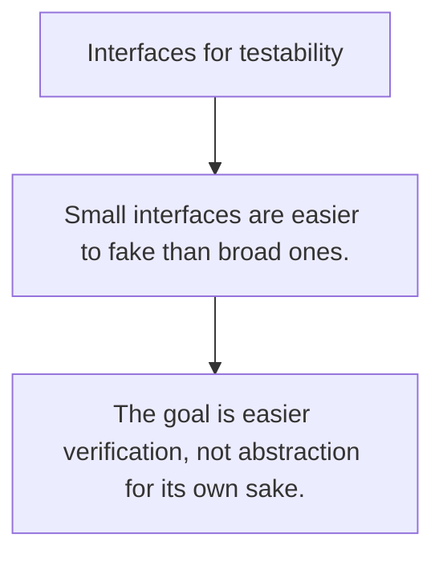

# TE.7 Interfaces for testability

## Mission

Learn how narrow interfaces create seams that let code be tested without real dependencies.

## Prerequisites

- TE.6

## Mental Model

A testing seam is a boundary where production code depends on behavior, not a concrete implementation.

## Visual Model



## Machine View

Interfaces matter for testability only when they represent a real boundary, not when they are invented around every concrete type.

## Run Instructions

```bash
go test ./08-quality-test/01-quality-and-performance/testing/7-interfaces-for-testability
```

## Code Walkthrough

### Small interfaces are easier to fake than broad ones.

Small interfaces are easier to fake than broad ones.

### Seams belong at dependency boundaries.

Seams belong at dependency boundaries.

### The goal is easier verification, not abstraction for i

The goal is easier verification, not abstraction for its own sake.

## Try It

1. Change one of the example inputs and rerun the lesson.
2. Explain which boundary the lesson is trying to make explicit.
3. Describe how you would apply TE.7 in a small service or tool.

## ⚠️ In Production

Design seams around unstable dependencies like time, network, storage, and third-party clients.

## 🤔 Thinking Questions

1. What problem does this topic solve?
2. What breaks if this boundary is handled implicitly instead of explicitly?
3. Where would you expect to use this topic in production Go code?

## Next Step

Continue to `TE.8`.
