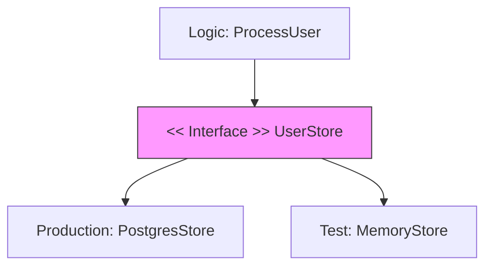

# TE.7 Interfaces for Testability

## Mission

Learn how to use Go interfaces to create "seams" in your application. Master the art of decoupling your business logic from external dependencies like databases, APIs, and the system clock so you can test in isolation without a real environment.

## Prerequisites

- TE.6 Fuzz Testing
- Core understanding of Go Interfaces (Section 03).

## Mental Model

Think of Testable Interfaces as **A Universal Power Adapter**.

1. **The Device**: Your business logic is a laptop. It needs power.
2. **The Socket**: In production, the power comes from a high-voltage wall socket (a real Database).
3. **The Adapter**: You don't plug the laptop directly into the wires. You use a standard plug interface.
4. **The Seam**: Because you use a standard plug, you can unplug the laptop from the wall and plug it into a battery pack (a Mock) during testing. The laptop doesn't know the difference.

## Visual Model



## Machine View

- **Implicit Satisfaction**: In Go, you don't need `implements`. If your struct has the right methods, it fits the interface. This makes it incredibly easy to swap a real dependency for a test one.
- **Narrow Interfaces**: Prefer small, focused interfaces (e.g., `Reader` or `Store`) over giant ones. They are much easier to implement in your tests.

## Run Instructions

```bash
# Run tests to see the memory-based implementation in action
go test -v ./08-quality-test/01-quality-and-performance/testing/7-interfaces-for-testability
```

## Code Walkthrough

### The Service Pattern
The code defines a `DataStore` interface. The business logic accepts this interface in its constructor. This allows us to pass a real SQL implementation in `main.go` and a simple map-based implementation in `main_test.go`.

## Try It

1. Look at `main.go`. Identify the interface and the two structs that implement it.
2. Add a new method to the interface (e.g., `Delete`). Notice how the compiler forces you to update both the production code AND the test code.
3. Try to test the logic without using the interface. How would you handle the database dependency?

## In Production
Don't over-interface. Only create an interface when you have a **Real Boundary** (Network, File System, Time, Third-party APIs). Interfaces add a small layer of abstraction that can make code navigation slightly harder, so use them where the testability benefit is clear.

## Thinking Questions
1. Why is it better to define the interface *where it is used* rather than *where it is implemented*?
2. How do interfaces help with "Parallel Development" in a team?
3. Can you test a function that uses `time.Now()` without using an interface?

## Next Step

Now that you have a seam, learn how to precisely control it. Continue to [TE.8 Mocking Patterns](../8-mocking-with-interfaces).
