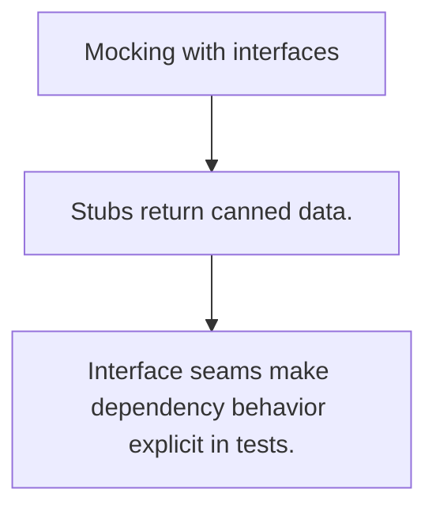

# TE.8 Mocking with interfaces

## Mission

Learn how manual mocks and stubs turn interface seams into precise behavior tests.

## Prerequisites

- TE.7

## Mental Model

A mock is a programmable stand-in for a dependency. It proves how the caller reacts when that dependency behaves a certain way.

## Visual Model



## Machine View

Tests become deterministic because the dependency contract is controlled directly inside the test.

## Run Instructions

```bash
go test ./08-quality-test/01-quality-and-performance/testing/8-mocking-with-interfaces
```

## Code Walkthrough

### Stubs return canned data.

Stubs return canned data.

### Mocks also verify interaction expectations.

Mocks also verify interaction expectations.

### Interface seams make dependency behavior explicit in t

Interface seams make dependency behavior explicit in tests.

## Try It

1. Change one of the example inputs and rerun the lesson.
2. Explain which boundary the lesson is trying to make explicit.
3. Describe how you would apply TE.8 in a small service or tool.

## ⚠️ In Production

Keep mocks simple. When a fake grows into a second application, the seam is probably too broad.

## 🤔 Thinking Questions

1. What problem does this topic solve?
2. What breaks if this boundary is handled implicitly instead of explicitly?
3. Where would you expect to use this topic in production Go code?

## Next Step

Continue to `TE.9`.
