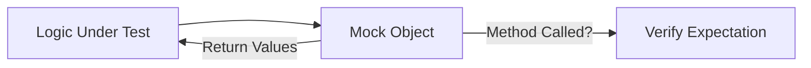

# TE.8 Mocking Patterns

## Mission

Master the use of Mocks and Stubs to precisely control dependency behavior during testing. Learn how to simulate errors, slow responses, and specific data returns to verify that your business logic handles every possible scenario.

## Prerequisites

- TE.7 Interfaces for Testability

## Mental Model

Think of a Mock as **An Actor with a Script**.

1. **The Role**: The actor is playing the part of a "Database Service."
2. **The Script**: You tell the actor: "When the hero asks for user 404, you must look sad and say 'Not Found'."
3. **The Performance**: You run your code. It calls the mock. The mock performs exactly as scripted.
4. **The Review**: You check if your code handled the "Not Found" response correctly (e.g., did it return a 404 HTTP status?).

## Visual Model



## Machine View

- **Stubs**: Just return canned data. They don't care how many times they are called.
- **Mocks**: Verify interactions. They fail the test if a method *wasn't* called, or if it was called with the wrong arguments.
- **Hand-written vs. Generated**: You can write mocks by hand (simple and clear) or use tools like `mockery` to generate them for complex interfaces. In this module, we focus on hand-written mocks to understand the mechanics.

## Run Instructions

```bash
# Run tests to see the mock returning specific results
go test -v ./08-quality-test/01-quality-and-performance/testing/8-mocking-with-interfaces
```

## Code Walkthrough

### The "Mock" Struct
We create a struct that implements the interface but includes "Hooks" or "Fields" that allow us to control its behavior from within a test.

### Testing Error Paths
Shows how to "Script" the mock to return an error, proving that the business logic doesn't crash and returns the correct error message to the caller.

## Try It

1. Change the mock in `main_test.go` to return a specific "Database Timeout" error.
2. Verify that your service handles this timeout gracefully.
3. Add a counter to the mock to verify that a specific method was called exactly once.

## In Production
**Don't over-mock.** If your test has more mock-setup code than actual logic-assertion code, your components might be too tightly coupled or your interfaces might be too broad. Mocks are for **Boundaries**, not for every internal function call.

## Thinking Questions
1. What is the difference between a "Stub," a "Mock," and a "Fake"?
2. Why is it dangerous to mock code that you don't own (e.g., a third-party library)?
3. When should you use a real database (Integration Test) instead of a Mock?

## Next Step

Next: `TE.9` -> `08-quality-test/01-quality-and-performance/testing/9-integration-tests`

Open `08-quality-test/01-quality-and-performance/testing/9-integration-tests/README.md` to continue.
