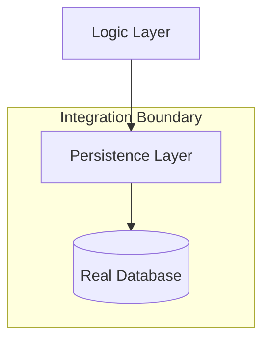

# TE.9 Integration Testing

## Mission

Learn how to write Integration Tests that verify components work together correctly across real boundaries. Understand the trade-offs between Unit Tests and Integration Tests, and learn how to manage external dependencies like databases or APIs using environment variables and setup/teardown logic.

## Prerequisites

- TE.8 Mocking Patterns

## Mental Model

Think of Integration Testing as **The Assembly Line Test**.

1. **The Parts**: You already tested the engine (Unit Test) and the wheels (Unit Test) separately.
2. **The Assembly**: Now you put them together.
3. **The Test**: You turn the key. Does the engine actually turn the wheels?
4. **The Scope**: You aren't testing every valve in the engine again. You are testing the **Connection** between the parts.

## Visual Model



## Machine View

- **Real Resources**: Unlike unit tests, integration tests use real databases, real networks, or real file systems.
- **`go test -short`**: Use this flag to skip slow integration tests during local development. In your test, check `if testing.Short() { t.Skip(...) }`.
- **Reproducibility**: The hardest part of integration testing is ensuring the environment is clean. Use `t.Cleanup` or `docker-compose` to manage the lifecycle of external services.

## Run Instructions

```bash
# Run tests (ensure any required local services are running if applicable)
go test -v ./08-quality-test/01-quality-and-performance/testing/9-integration-tests
```

## Code Walkthrough

### Shared State Management
The code demonstrates how to initialize a real database connection (or a simulated one like SQLite) and ensure that data created in one test doesn't leak into the next.

### Environmental Configuration
Shows how to use environment variables (e.g., `DB_URL`) to allow the same test to run against a local SQLite for speed and a real Postgres in CI for accuracy.

## Try It

1. Modify the test to use a different database name. Watch it fail during connection.
2. Add a `t.Skip` check to the test and run with `go test -short`.
3. Try to run two integration tests in parallel. What happens to the shared data?

## In Production
**Don't try to cover every edge case with integration tests.** They are slow, brittle, and expensive. Use them to verify that your **Configurations** and **Schemas** are correct. Use Unit Tests for complex logic. A healthy test suite follows the "Test Pyramid": thousands of Unit Tests, hundreds of Integration Tests, and a dozen End-to-End Tests.

## Thinking Questions
1. Why are integration tests often "Flaky" (randomly failing)?
2. How does "Containerization" (Docker) change the way we write integration tests?
3. Should integration tests run on every commit, or only before a release?

## Next Step

Next: `TE.10` -> `08-quality-test/01-quality-and-performance/testing/10-golden-files`

Open `08-quality-test/01-quality-and-performance/testing/10-golden-files/README.md` to continue.
