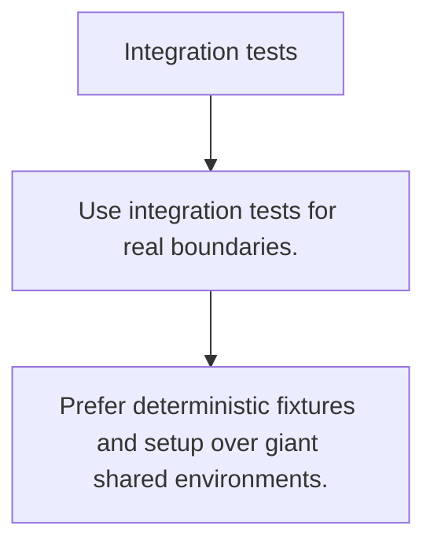

# TE.9 Integration tests

## Mission

Learn where integration tests sit between unit tests and end-to-end tests and what they should actually prove.

## Prerequisites

- TE.8

## Mental Model

Integration tests verify that real components work together across a boundary.

## Visual Model



## Machine View

They are slower and costlier than unit tests because they involve real serialization, storage, or network behavior.

## Run Instructions

```bash
go test ./08-quality-test/01-quality-and-performance/testing/9-integration-tests
```

## Code Walkthrough

### Use integration tests for real boundaries.

Use integration tests for real boundaries.

### Keep the assertion focused on the seam under test.

Keep the assertion focused on the seam under test.

### Prefer deterministic fixtures and setup over giant sha

Prefer deterministic fixtures and setup over giant shared environments.

## Try It

1. Change one of the example inputs and rerun the lesson.
2. Explain which boundary the lesson is trying to make explicit.
3. Describe how you would apply TE.9 in a small service or tool.

## ⚠️ In Production

Integration tests should protect the seams that break most often in production, not try to duplicate every unit test with more infrastructure.

## 🤔 Thinking Questions

1. What problem does this topic solve?
2. What breaks if this boundary is handled implicitly instead of explicitly?
3. Where would you expect to use this topic in production Go code?

## Next Step

Continue to `TE.10`.
