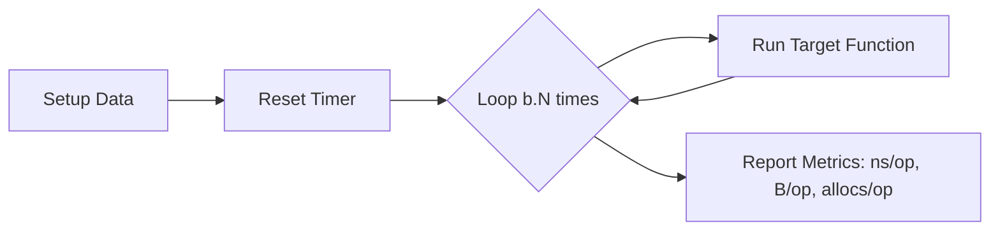

# TE.4 Benchmarking

## Mission

Master the use of `testing.B` to measure and compare code performance. Learn how to interpret `ns/op`, `B/op`, and `allocs/op` to prove that an optimization actually delivers a benefit without introducing regressions.

## Prerequisites

- TE.1 Unit Testing
- Basic understanding of Go slices and memory allocation.

## Mental Model

Think of a Benchmark as a **Digital Stopclock on a Loop**.

1. **The Setup**: You prepare the environment (e.g., creating a large slice).
2. **The Timer**: You start the clock (`b.ResetTimer()`).
3. **The Loop**: You run the target function `b.N` times. `b.N` is adjusted automatically by Go to get a statistically significant result.
4. **The Metrics**: You read the result (e.g., "100 ns/op" means it took 100 nanoseconds per iteration).

## Visual Model



## Machine View

- **`b.N`**: Go starts with a small N and increases it until the benchmark runs for about 1 second.
- **`-benchmem`**: This flag instructs the runner to record memory allocations. High `allocs/op` usually points to GC pressure, which is often a bigger bottleneck than raw CPU instructions.
- **Compiler Optimizations**: Be careful of "Dead Code Elimination." If you don't use the result of a function, the compiler might skip it entirely, making your benchmark look impossibly fast.

## Run Instructions

```bash
# Run all benchmarks in this directory
go test -bench=. -benchmem ./08-quality-test/01-quality-and-performance/testing/benchmarks
```

## Code Walkthrough

### `BenchmarkStringConcat`
Compares `+` operator vs `strings.Builder`. At small scales, they look similar. At large scales, `strings.Builder` wins by avoiding repeated allocations.

### `BenchmarkSliceGrowth`
Compares `append()` on a nil slice vs `make([]T, 0, cap)`. Pre-allocating capacity eliminates resizing costs.

## Try It

1. Run the benchmarks and compare the `B/op` for different string concatenation methods.
2. Modify `benchmarks_test.go` to increase the size of the strings being concatenated. Watch how the performance gap widens.
3. Remove `b.ResetTimer()` and see how expensive setup work inflates your `ns/op`.

## In Production
Never optimize based on a "feeling." Always write a benchmark first. Micro-benchmarks are great for utility functions (parsers, math, etc.), but they don't capture system-level effects like network latency or database lock contention. For those, you need **Profiling** (`PR.1`).

## Thinking Questions
1. Why does `b.N` change between different runs of the same benchmark?
2. If two functions have the same `ns/op` but one has 10x more `allocs/op`, which one should you prefer for a high-traffic server?
3. What happens if you put a `defer` inside the `b.N` loop?

## Next Step

After measuring micro-performance, learn how to keep your test code clean and isolated. Continue to [TE.5 Sub-tests and Cleanup](../5-sub-tests-and-cleanup).
