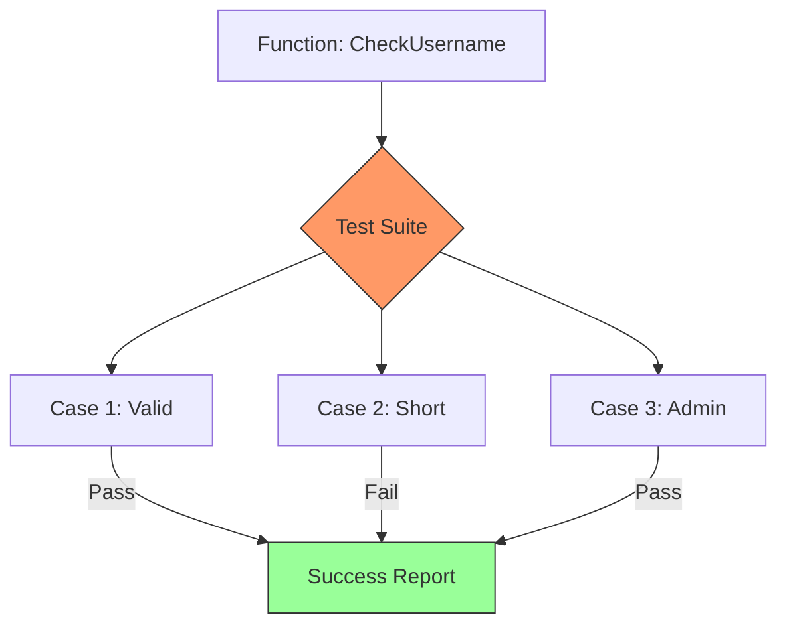

# TE.1 Unit Testing: The Foundation of Quality

## Mission

Master the fundamentals of Unit Testing in Go. Learn the difference between traditional tests and "Table-Driven" tests, understand how to use sub-tests for granular reporting, and learn why Go engineers prefer the standard `testing` package over complex assertion frameworks.

## Prerequisites

- Section 01 - 07 complete.

## Mental Model

Think of Unit Testing as **A Digital Quality Inspector**.

1. **The Component**: You just manufactured a high-pressure valve (`CheckUsername` function).
2. **The Inspector**: Before it goes into the engine, you put it on a test bench (`TestCheckUsername`).
3. **The Scenarios (Table)**: You test it with normal pressure (Valid Name), zero pressure (Too Short), and reverse pressure (Admin loophole).
4. **The Report**: If any scenario fails, the bench marks that specific component as "RED," but allows you to continue testing the next one.

## Visual Model



## Machine View

- **`go test`**: This is the tool that orchestrates everything. It scans for files ending in `_test.go`, compiles them along with your code, and executes functions that match `func TestXxx(t *testing.T)`.
- **Zero Magic**: Unlike other languages, Go tests don't use "Annotations" or "Reflection" tricks. They are just regular Go code.
- **Fail Fast vs. Continue**:
    - `t.Errorf`: Marks the test as failed but continues execution. Great for table tests.
    - `t.Fatalf`: Marks the test as failed and stops immediately. Use this when a setup step fails (e.g., "Failed to connect to DB").

## Run Instructions

```bash
# Run all tests in the current directory
go test ./08-quality-test/01-quality-and-performance/testing/user

# Run with verbose output (shows sub-test names)
go test -v ./08-quality-test/01-quality-and-performance/testing/user
```

## Code Walkthrough

### Table-Driven Pattern
We define a slice of anonymous structs:
```go
testCases := []struct {
    desc     string
    input    string
    expected bool
}{
    {"Valid username", "rasel9t6", true},
    // ...
}
```
This is the **Gold Standard** for testing in Go. It's clean, easy to expand, and separates your "Logic" from your "Data."

### Sub-tests (`t.Run`)
Inside the loop, we call `t.Run(tc.desc, ...)`. This gives each row of the table its own "Identity" in the test output. If `tc.desc` is "Too short," and it fails, you know exactly which input caused the problem.

### Testify vs. Standard Lib
In this module, we use the `testify/assert` package.
- **Standard Lib**: Requires `if actual != expected { t.Errorf(...) }`.
- **Testify**: `assert.Equal(t, expected, actual)`.
It's more readable and provides better diffs when things break.

## Try It

1. Change `CheckUsername` to require 10 characters instead of 6. Run `go test` and watch the table tests fail.
2. Add a new case to the table: `{"Empty string", "", false}`. Verify it passes.
3. Try running only the Login tests: `go test -v -run TestLogin ./08-quality-test/01-quality-and-performance/testing/user`.

## Verification Surface

Observe the clean report from the table-driven tests:

```text
=== RUN   TestCheckUsername_TableDriven
=== RUN   TestCheckUsername_TableDriven/Valid_username
=== RUN   TestCheckUsername_TableDriven/Too_short
=== RUN   TestCheckUsername_TableDriven/Exact_minimum_length
--- PASS: TestCheckUsername_TableDriven (0.00s)
    --- PASS: TestCheckUsername_TableDriven/Valid_username (0.00s)
    --- PASS: TestCheckUsername_TableDriven/Too_short (0.00s)
PASS
ok      the-go-engineer/08-quality-test/01-quality-and-performance/testing/user 0.005s
```

## In Production
**Test your error paths.**
Don't just test the "Happy Path" (success). Most bugs live in the error handling code. Ensure your functions return the *correct* error type or message when inputs are invalid.

## Thinking Questions
1. Why do we put test files in the same package as the code we are testing?
2. What is the benefit of `t.Errorf` over a simple `panic`?
3. How do you handle a function that returns a random value? (Hint: Test for a range or a property, not a specific number).

## Next Step

Next: `TE.4` -> `08-quality-test/01-quality-and-performance/testing/benchmarks`

Open `08-quality-test/01-quality-and-performance/testing/benchmarks/README.md` to continue.
