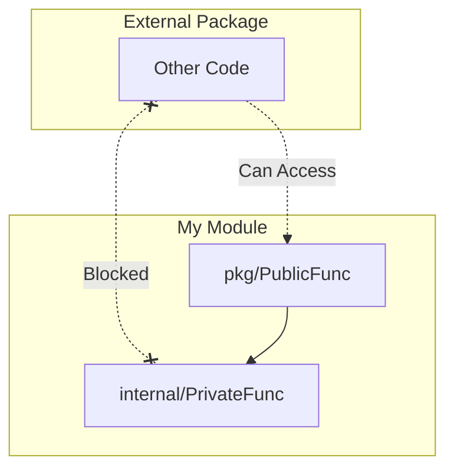

# PD.2 Visibility and Export Rules

## Mission

Master the use of Exported vs. Unexported identifiers to define your package's "Public API." Learn how to use the `internal/` directory to strictly enforce boundaries and prevent other packages from depending on your implementation details.

## Prerequisites

- PD.1 Naming Conventions

## Mental Model

Think of Visibility as **A Restaurant Kitchen**.

1. **The Dining Room (Public API)**: This is what the customers see (Exported identifiers like `OrderPizza`). It's a clean, stable interface.
2. **The Kitchen (Unexported)**: This is where the work happens (Unexported identifiers like `kneadDough`, `preheatOven`). Customers don't need to know how the dough is kneaded.
3. **The Staff Only Door (`internal/`)**: This is a room that even other restaurants in the same building can't enter. Only your staff can use it. It's for implementation details that must be shared between your own packages but hidden from the world.

## Visual Model



## Machine View

- **Capitalization**: If it starts with an Uppercase letter, it's Exported (Public). If it's lowercase, it's Unexported (Private).
- **`internal/` directory**: The Go compiler treats any directory named `internal` as special. Only packages in the parent directory tree can import from it. This is a "hard" boundary enforced at compile time.

## Run Instructions

```bash
# Run the demo to see visibility errors in action
go run ./09-architecture/01-package-design/2-visibility
```

## Code Walkthrough

### Exported vs. Unexported
Shows how changing the first letter of a struct field or function name changes whether it can be accessed from `main.go`.

### The `internal` Boundary
Demonstrates an attempt to import a package from an `internal` folder. You will see the compiler error: `use of internal package ... not allowed`.

## Try It

1. Look at `main.go`. Try to access an unexported field in the `user` struct. What error does the compiler give?
2. Move a helper package into a directory named `internal`. Try to import it from `main.go`.
3. Discuss: When should you make a field exported vs. unexported?

## In Production
**Export as little as possible.** Every exported identifier is a promise you have to keep. If you export a field, users will depend on it, and you can't change its type without a breaking change. Use `internal/` for everything that doesn't *absolutely* need to be public.

## Thinking Questions
1. Why does Go use capitalization instead of keywords like `public` or `private`?
2. How does the `internal/` directory help with versioning and refactoring?
3. Can a sub-package access unexported identifiers in its parent package?

## Next Step

Next: `PD.3` -> `09-architecture/01-package-design/3-project-layout`

Open `09-architecture/01-package-design/3-project-layout/README.md` to continue.
