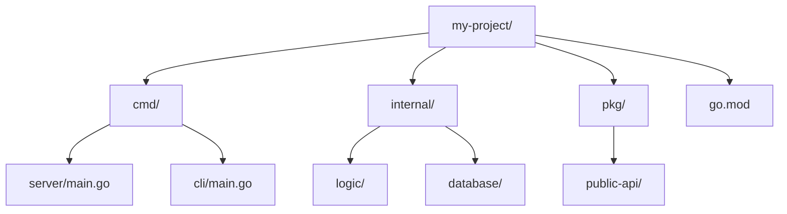

# PD.3 Project Layout

## Mission

Master the standard Go project structure. Learn when to keep a project flat, when to use `cmd/` for multiple binaries, and how to use `internal/` and `pkg/` to organize complex systems while maintaining clean boundaries.

## Prerequisites

- PD.1 Naming Conventions
- PD.2 Visibility and Export Rules

## Mental Model

Think of Project Layout as **Organizing a Workshop**.

1. **The Workbench (Flat Layout)**: For a small project, you just put everything on the table. It's fast and easy.
2. **The Tool Chest (`internal/`)**: As you get more tools, you put the specialty ones in a drawer that only you use.
3. **The Display Window (`pkg/`)**: Some tools you want to share with neighbors. You put them on a shelf that's accessible from the outside.
4. **The Instruction Manuals (`cmd/`)**: If you build several different machines (a server, a CLI, a cron job) that use the same parts, you put their individual "Start" buttons in separate folders.

## Visual Model



## Machine View

- **`cmd/`**: Each subdirectory here is a `package main`. This is where the application starts.
- **`internal/`**: Code that is private to this project. The compiler prevents other modules from importing it.
- **`pkg/`**: (Optional) Code that is intended to be used by other projects. Many modern Go projects skip `pkg/` and put shared code in the root or in a separate module.
- **Root**: Contains `go.mod`, `go.sum`, and often the most important domain logic if the project is small.

## Run Instructions

```bash
# Run the layout demo
go run ./09-architecture/01-package-design/3-project-layout
```

## Code Walkthrough

### Small Project (Flat)
Everything in the root. Perfect for libraries or simple tools.

### Large Project (Structured)
Uses `cmd/` for binaries and `internal/` for core logic. Prevents "Folder Sprawl" and circular dependencies.

## Try It

1. Look at the directory structure of this repository. Is it Flat or Structured?
2. Move a package from the root into `internal/`. Try to import it from another project on your machine.
3. Add a new command to the `cmd/` folder (e.g., `cmd/cleanup/main.go`) that imports logic from `internal/`.

## In Production
**Don't over-engineer your layout.** Start flat. Only create a new folder when you have a clear reason (e.g., you need to hide private code, or you need to build two different binaries). Go is not Java; deep folder hierarchies like `src/main/java/com/company/project/module` are an anti-pattern.

## Thinking Questions
1. Why is the `cmd/` directory useful for large teams?
2. If a project has only one binary, do you still need a `cmd/` folder?
3. What happens if you try to import a package from another project's `internal/` directory?

## Next Step

Next: `ARCH.1` -> `09-architecture/03-architecture-patterns/1-architecture-trade-offs`

Open `09-architecture/03-architecture-patterns/1-architecture-trade-offs/README.md` to continue.
