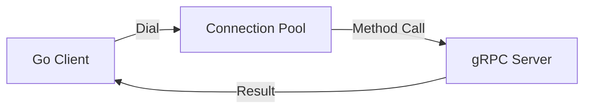

# GR.3 Unary Client

## Mission

Build a Unary gRPC Client. Learn how to connect to a server, manage connection lifecycles with `grpc.NewClient()`, and make typed method calls. Master the use of **Contexts with Deadlines** to ensure your client doesn't hang forever on a slow network.

## Prerequisites

- GR.2 Unary Server

## Mental Model

Think of a Unary Client as **A Customer at the Vending Machine**.

1. **The Connection (Dial)**: You walk up to the machine and make sure it's plugged in.
2. **The Request (Call)**: You press the button and wait.
3. **The Patience (Deadline)**: You decide: "If this machine doesn't give me my snack in 5 seconds, I'm walking away."
4. **The Response**: You get your snack or an error message ("Out of Stock").

## Visual Model



## Machine View

- **`grpc.NewClient`**: Creates a connection to the server. By default, gRPC connections are lazy and persistent; they don't actually "dial" until the first request is made.
- **Context Deadlines**: gRPC has NO default timeout. You MUST use `context.WithTimeout()` or `context.WithDeadline()` for every call to prevent resource leaks.
- **Client Stubs**: The generated code provides a "Stub" (e.g., `NewUserServiceClient`) that wraps the raw connection and provides a typed API.

## Run Instructions

```bash
# Start the server first in another terminal
# go run ./09-architecture/02-grpc/1-unary/server

# Run the client
go run ./09-architecture/02-grpc/1-unary/client
```

## Code Walkthrough

### Connecting to the Server
Shows the use of `grpc.NewClient` with `grpc.WithTransportCredentials(insecure.NewCredentials())` for local development.

### Making the Call
Demonstrates how to create a context with a 1-second timeout and call a remote method just like a local function call.

## Try It

1. Try to run the client without starting the server. What error do you get? How long does it take to fail?
2. Reduce the timeout to 1 millisecond. Watch the call fail with `DeadlineExceeded`.
3. Discuss: Why is it better to use gRPC status codes instead of parsing error strings?

## In Production
**Reuse your connections.** Don't call `NewClient` for every request. Create the connection once when your application starts and share it across all your handlers. Use **Interceptors** on the client side for tracing, retries, and monitoring. Always use TLS (SEC.8) in production.

## Thinking Questions
1. What happens if the server restarts? Does the client need to reconnect manually?
2. How do you handle "Retries" in a gRPC client?
3. What is the difference between `grpc.NewClient` and the older `grpc.Dial`?

## Next Step

Unary calls are great, but sometimes you need to send or receive a stream of data. Learn about the more advanced gRPC patterns. Continue to [GR.4 Streaming Server](../../2-streaming/server).
