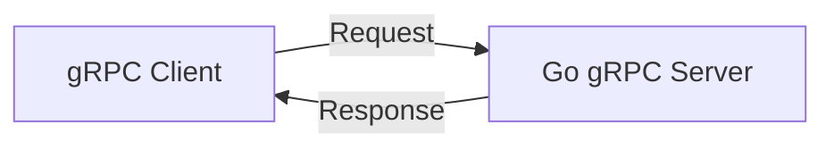

# GR.2 Unary Server

## Mission

Build a Unary gRPC Server. Learn how to implement the generated Go interfaces, handle incoming requests, and return strictly-typed responses. Master the use of `grpc.NewServer()` and service registration.

## Prerequisites

- GR.1 Protobuf Schema

## Mental Model

Think of a Unary Server as **A Vending Machine**.

1. **The Request**: You press a button (Call a method) and put in your money (The input message).
2. **The Processing**: The machine checks your money, finds the snack, and drops it into the bin. (The method implementation).
3. **The Response**: You take your snack. (The output message).
4. **The Connection**: One request, one response. Simple and direct.

## Visual Model



## Machine View

- **HTTP/2**: gRPC runs on top of HTTP/2. It uses persistent connections, header compression, and multiplexing to be more efficient than standard HTTP/1.1 REST APIs.
- **Service Registration**: You must register your implementation with the gRPC server using the generated `RegisterXxxServer` function.
- **Error Handling**: Use the `google.golang.org/grpc/status` package to return rich error codes (like `NotFound`, `InvalidArgument`, or `Unavailable`) instead of just generic error strings.

## Run Instructions

```bash
# Start the unary server
go run ./09-architecture/02-grpc/1-unary/server
```

## Code Walkthrough

### Implementing the Interface
Shows how the generated Go code creates an interface, and how you must satisfy it by creating a struct with matching methods.

### Starting the Listener
Demonstrates how to open a TCP listener and start the gRPC server.

## Try It

1. Start the server. It will wait for incoming connections.
2. Look at `main.go`. Modify the `GetUser` method to return a "Not Found" error if the ID is 0.
3. Discuss: How does a gRPC server handle concurrent requests? (Hint: It's similar to `net/http`).

## In Production
**Always use Interceptors.** Interceptors are the gRPC equivalent of middleware. Use them for logging, authentication (SEC.4), and monitoring. Never implement your business logic directly in the gRPC layer; call a Service Layer (ARCH.5) instead.

## Thinking Questions
1. What is the difference between a Unary call and a standard HTTP REST call?
2. Why does gRPC require HTTP/2?
3. How do you handle "Timeouts" on the server side?

## Next Step

A server is useless without a client. Learn how to call your new service. Continue to [GR.3 Unary Client](../client).
