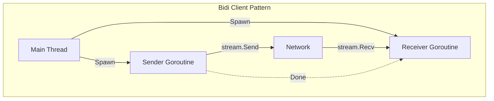

# GR.5 Streaming Client

## Mission

Build gRPC Streaming Clients. Learn how to initiate streams, send/receive multiple messages, and properly close connections. Master the pattern of using **Goroutines** to handle bidirectional communication without deadlocking.

## Prerequisites

- GR.4 Streaming Server

## Mental Model

Think of a Streaming Client as **A Walkie-Talkie**.

1. **The Handshake**: You tune into the right channel (Dial the server).
2. **The Transmission**: You hold the button to talk (Client Stream) or listen to the broadcast (Server Stream).
3. **The Coordination**: In Bidi mode, you have to be ready to hear a response even while you are still talking.
4. **Over and Out**: You explicitly signal when you are done sending so the other side knows to finish.

## Visual Model



## Machine View

- **`CloseSend()`**: Critical for client-side and bidi streaming. It tells the server "I have no more data to send, but I'm still listening for your response."
- **Context Cancellation**: Canceling the context will immediately terminate the stream on both sides.
- **Interceptors**: Client-side interceptors can wrap the entire stream lifecycle, allowing you to log the start and end of long-lived connections.

## Run Instructions

```bash
# Start the server first
# go run ./09-architecture/02-grpc/2-streaming/server

# Run the streaming client
go run ./09-architecture/02-grpc/2-streaming/client
```

## Code Walkthrough

### Receiver Loop
Shows the standard `for { msg, err := stream.Recv() ... }` pattern.

### Concurrent Sender
Demonstrates how to use a goroutine to send messages while the main thread waits for the stream to close.

## Try It

1. Start the server and client.
2. Kill the server while the client is streaming. Observe how the client's `Recv()` call returns an error.
3. Modify the client to send 100 messages as fast as possible. Does the server keep up?
4. Discuss: Why is it important to call `CloseSend()`?

## In Production
**Don't keep streams open forever.** Even with keep-alives, network partitions will eventually kill your connection. Your client must be able to **Reconnect** and resume its work. Use "Backoff" strategies (like exponential backoff) when reconnecting to avoid overwhelming a struggling server.

## Thinking Questions
1. How do you handle "Heartbeats" in a gRPC stream?
2. What is the memory impact of having 10,000 open Bidi streams on a single client?
3. When should you use a Stream vs. a simple Retry loop for a Unary call?

## Next Step

Congratulations! You've mastered the complex world of gRPC. Return to the [09 Architecture & Security overview](../../README.md) or explore the high-level patterns in [Track ARCH](../../../03-architecture-patterns/README.md).
