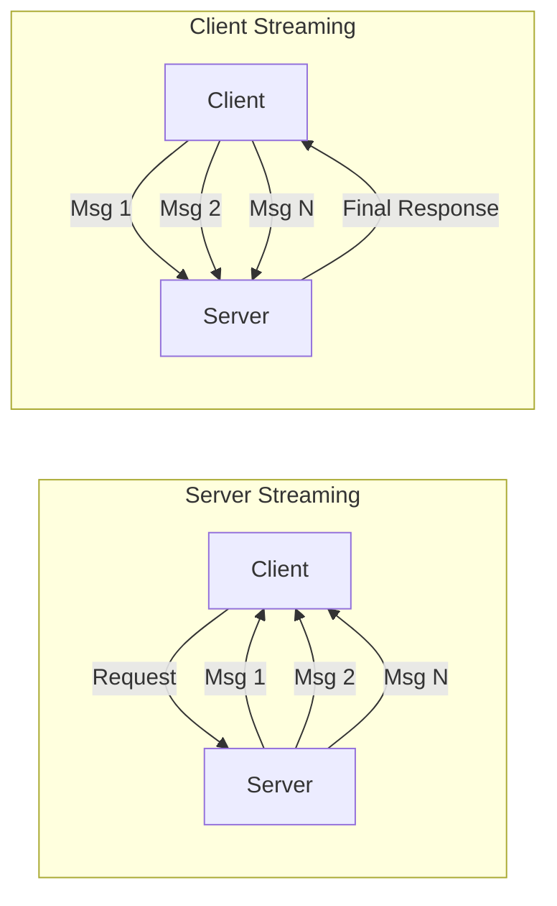

# GR.4 Streaming Server

## Mission

Master gRPC Streaming. Learn how to implement **Server-side Streaming**, **Client-side Streaming**, and **Bidirectional (Bidi) Streaming**. Understand how to manage long-lived connections, handle partial failures, and use stream contexts for cancellation.

## Prerequisites

- GR.2 Unary Server

## Mental Model

Think of Streaming as **A Phone Call vs. A Text Message**.

1. **Unary (Text)**: You send one message, they send one back.
2. **Server Streaming (Podcast)**: You ask for a topic, and the server starts a continuous broadcast of data.
3. **Client Streaming (Uploading a File)**: You send many small chunks of data, and the server says "Got it all" at the end.
4. **Bidi Streaming (Live Chat)**: Both of you can talk at the same time, whenever you want, over the same connection.

## Visual Model



## Machine View

- **`Recv()` and `Send()`**: These are blocking calls. You typically use a `for` loop to process messages until `io.EOF` is returned.
- **Concurrency**: Bidi streaming often requires two goroutines: one for sending and one for receiving.
- **Flow Control**: HTTP/2 handles the "Window Size" to ensure a fast sender doesn't overwhelm a slow receiver.

## Run Instructions

```bash
# Start the streaming server
go run ./09-architecture/02-grpc/2-streaming/server
```

## Code Walkthrough

### Server Streaming Example
Shows how to loop over a slice of data and call `stream.Send()` for each item.

### Bidirectional Example
Demonstrates a "Chat" service where the server receives a message and immediately echoes it back to all connected clients.

## Try It

1. Start the server.
2. Look at `main.go`. Add a `time.Sleep` between `Send()` calls to simulate a slow data producer.
3. Discuss: When would you use Streaming instead of a simple Unary call?

## In Production
**Beware of Load Balancers.** Many L7 load balancers (like standard NGINX or some Cloud ALBs) have short timeouts for long-lived connections. You may need to implement **Keep-Alives** or increase the "Idle Timeout" to keep your streams open. Monitor your "Stream Count" to ensure you aren't leaking connections.

## Thinking Questions
1. How do you handle an error in the middle of a 100-message stream?
2. Why is `io.EOF` used to signal the end of a stream?
3. What is the difference between a gRPC stream and a Web Socket?

## Next Step

Learn how to consume these streams without blocking your entire application. Continue to [GR.5 Streaming Client](../client).
