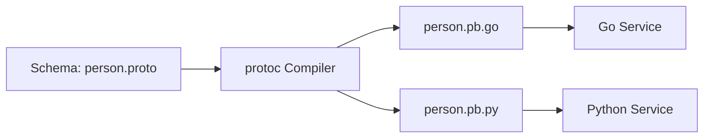

# GR.1 Protobuf Schema

## Mission

Master Protocol Buffers (Protobuf) to define strictly-typed, language-agnostic service contracts. Learn how to define messages, services, and field types that serve as the single source of truth for your microservices.

## Prerequisites

- None (Foundational concept for gRPC).

## Mental Model

Think of Protobuf as **A Multi-Lingual Legal Contract**.

1. **The Contract (`.proto`)**: You write down the rules in a neutral language. "Every person must have a Name (string) and an Age (int32)."
2. **The Lawyers (Compiler)**: You give the contract to the `protoc` compiler. It translates the contract into Go, Python, Java, or whatever language your services speak.
3. **The Result**: Every service knows exactly what a "Person" looks like. If one service tries to send an "Age" as a string, the code won't even compile. The contract is strictly enforced.

## Visual Model



## Machine View

- **Binary Serialization**: Unlike JSON (text), Protobuf is a binary format. It is significantly smaller and faster to parse, saving CPU and bandwidth.
- **Field Tags**: Every field has a number (e.g., `string name = 1;`). These numbers are used in the binary format, making it easy to rename fields in code without breaking the wire format.
- **Forward/Backward Compatibility**: You can add new fields to a message without breaking old clients, provided you don't change the field tags.

## Run Instructions

```bash
# View the schema definition
cat ./09-architecture/02-grpc/proto/user.proto
```

## Try It

1. Look at `user.proto`. Add a new field `email` with tag `3`.
2. (Optional) If you have `protoc` installed, run the generation script to see how the Go code updates.
3. Discuss: Why are field tags (1, 2, 3) more important than field names in Protobuf?

## In Production
**Treat your `.proto` files as immutable.** Never change a field tag once it has been deployed. Never change the type of a field tag. If you need to make a breaking change, create a new message or service version (e.g., `UserServiceV2`).

## Thinking Questions
1. Why is Protobuf faster than JSON?
2. What is the difference between `optional`, `required` (deprecated), and `repeated`?
3. How do you handle "Enums" in Protobuf?

## Next Step

Now that you have a contract, learn how to build a service that fulfills it. Continue to [GR.2 Unary Server](../1-unary/server).
