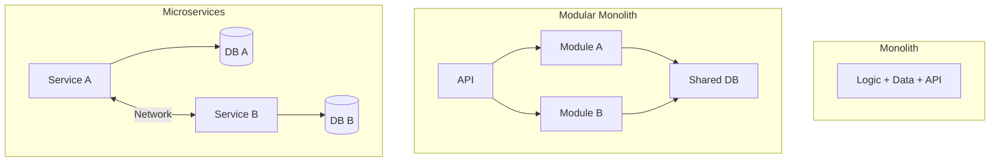

# ARCH.1 Monolith vs. Microservices

## Mission

Understand the fundamental trade-offs between different system architectures. Learn how to choose between a **Simple Monolith**, a **Modular Monolith**, and **Microservices** based on team size, system complexity, and operational maturity.

## Prerequisites

- Section 07: Concurrency (Understanding distributed behavior)
- Section 08: Quality & Testing (Understanding boundaries)

## Mental Model

Think of System Architecture as **Organizing a Company**.

1. **The Startup (Monolith)**: Everyone is in one room. Communication is instant, decisions are fast, but as you grow to 100 people, the room becomes a chaotic mess.
2. **The Departmentalized Company (Modular Monolith)**: People are in the same building but sit in departments (Marketing, Engineering). They have clear boundaries but share the same cafeteria (Database) and front door (Deployment).
3. **The Global Corporation (Microservices)**: Every department is in a different city. They are completely independent and can grow as big as they want, but they have to use phones (Network calls) to talk, which is slow and can fail.

## Visual Model



## Machine View

- **Deployment Unit**: A Monolith is one binary. Microservices are many binaries.
- **Failure Domain**: In a Monolith, one crash takes everything down. In Microservices, a crash in Service A might not impact Service B (Partial Failure).
- **Latency**: Calls inside a Monolith are nanoseconds (function calls). Calls between Microservices are milliseconds (network calls).

## Run Instructions

```bash
# Run the demo to see how boundaries impact execution
go run ./09-architecture/03-architecture-patterns/1-architecture-trade-offs
```

## Code Walkthrough

### The "All-in-One" Logic
Shows a simple program where every function calls every other function directly.

### The "Service-Oriented" Logic
Simulates a network call between two components, demonstrating how you have to handle timeouts, retries, and serialization errors.

## Try It

1. Modify the "Microservice" simulation to return a random error 10% of the time.
2. Add a "Retry" loop to the caller. Does this make the system more robust or just slower?
3. Discuss: At what point (number of developers or lines of code) would you switch from a Flat Monolith to a Modular Monolith?

## In Production
**Don't start with Microservices.** It is an "Architecture of Scale," not an "Architecture of Speed." Most startups fail before they reach the scale where microservices are necessary. Start with a clean Modular Monolith, and only split out services when a specific component has a different scaling or deployment requirement than the rest.

## Thinking Questions
1. Why is a "Distributed Monolith" the worst of both worlds?
2. How does "Data Ownership" change when you move to microservices?
3. What is the "Network Tax," and why does it matter?

## Next Step

Once you've chosen your high-level shape, learn how to organize the logic inside it. Continue to [ARCH.2 Domain-Driven Design basics](../2-ddd-basics).
