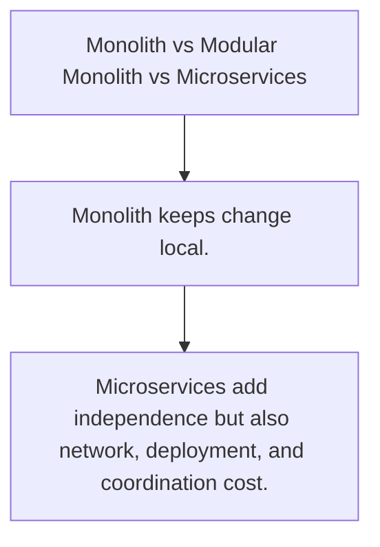

# ARCH.1 Monolith vs Modular Monolith vs Microservices

## Mission

Compare the default service shapes teams choose as systems and organizations grow.

## Prerequisites

- none

## Mental Model

Architecture is a cost allocation decision. Every boundary buys one kind of freedom by adding another kind of overhead.

## Visual Model



## Machine View

Deployment units, failure domains, data ownership, and team coordination all change when boundaries move.

## Run Instructions

```bash
go run ./09-architecture/03-architecture-patterns/1-architecture-trade-offs
```

## Code Walkthrough

### Monolith keeps change local.

Monolith keeps change local.

### Modular monolith keeps one deploy while improving inte

Modular monolith keeps one deploy while improving internal boundaries.

### Microservices add independence but also network, deplo

Microservices add independence but also network, deployment, and coordination cost.

## Try It

1. Change one of the example inputs and rerun the lesson.
2. Explain which boundary the lesson is trying to make explicit.
3. Describe how you would apply ARCH.1 in a small service or tool.

## ⚠️ In Production

The right default is the one that keeps change cheap for your current team and system size.

## 🤔 Thinking Questions

1. What problem does this topic solve?
2. What breaks if this boundary is handled implicitly instead of explicitly?
3. Where would you expect to use this topic in production Go code?

## Next Step

Continue to `ARCH.2`.
