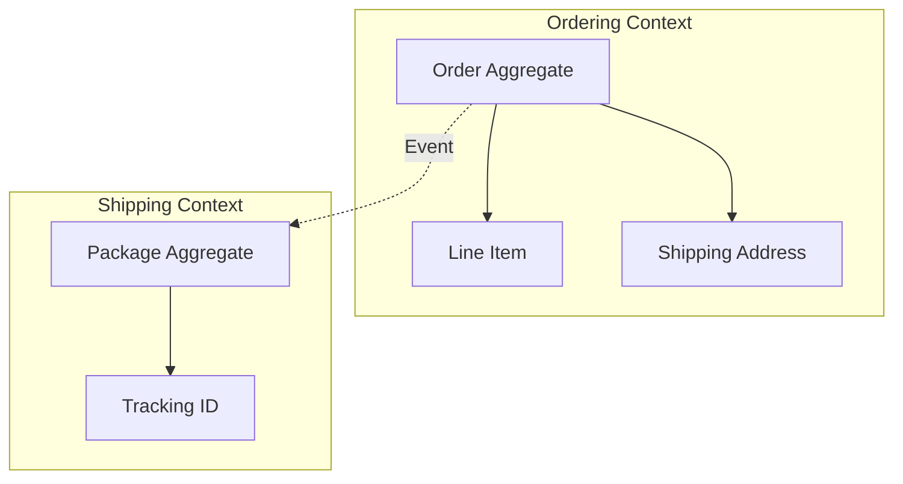

# ARCH.2 Domain-Driven Design (DDD) Basics

## Mission

Learn how to use Domain-Driven Design to manage business complexity. Understand how **Bounded Contexts**, **Aggregates**, and **Ubiquitous Language** help teams build code that accurately reflects the real-world problems they are solving.

## Prerequisites

- ARCH.1 Monolith vs. Microservices

## Mental Model

Think of DDD as **Creating a Map and a Dictionary**.

1. **The Map (Bounded Contexts)**: Different departments use the same word for different things. To a "Sales" person, a "User" is a lead. To a "Support" person, a "User" is someone with a ticket. In DDD, we draw a map around these departments so they can each have their own definition of "User" without confusing each other.
2. **The Dictionary (Ubiquitous Language)**: Developers and Business Experts must use the *exact same words*. If the business says "Onboarding," the code should say `Onboarding()`, not `CreateAccountProcess()`.
3. **The Rules (Aggregates)**: Some objects are inseparable. When you buy a "Book," you don't just buy the pages. You buy the whole thing. In DDD, the Book is an Aggregate, and you can only change the pages *through* the Book.

## Visual Model



## Machine View

- **Entities**: Objects with a unique ID (e.g., a `User` with an ID). They change over time but remain the "same" person.
- **Value Objects**: Objects defined only by their values (e.g., `Money{Amount: 10, Currency: "USD"}`). If you change the amount, it's a *different* piece of money.
- **Aggregates**: A cluster of objects that are treated as a single unit for data changes. They maintain "Invariants" (rules that must always be true).

## Run Instructions

```bash
# Run the demo to see how DDD types are structured in Go
go run ./09-architecture/03-architecture-patterns/2-ddd-basics
```

## Code Walkthrough

### Value Objects in Go
Shows how to use structs to enforce rules (e.g., an `Email` type that validates its format on creation).

### Aggregates and Invariants
Demonstrates a `BankAccount` aggregate that prevents a withdrawal if the balance is too low, ensuring the "Balance never negative" rule is always enforced.

## Try It

1. Look at `main.go`. Identify which structs are Entities and which are Value Objects.
2. Add a new rule to the `Order` aggregate: "Orders over $1000 require a manager's approval."
3. Discuss: Why is it better to put business rules inside the Aggregate rather than in the HTTP handler?

## In Production
**Don't "Over-DDD" small projects.** DDD is for **Complex Domains**. If your app is just "reading and writing a single table in a database" (CRUD), DDD will add unnecessary overhead. Use it when you find yourself struggling to keep business rules consistent across multiple parts of your system.

## Thinking Questions
1. What is "Ubiquitous Language," and why does it matter for long-term maintenance?
2. How does a Bounded Context prevent "The Big Ball of Mud"?
3. When should an Entity become a Value Object?

## Next Step

Next: `ARCH.3` -> `09-architecture/03-architecture-patterns/3-hexagonal-architecture-in-go`

Open `09-architecture/03-architecture-patterns/3-hexagonal-architecture-in-go/README.md` to continue.
