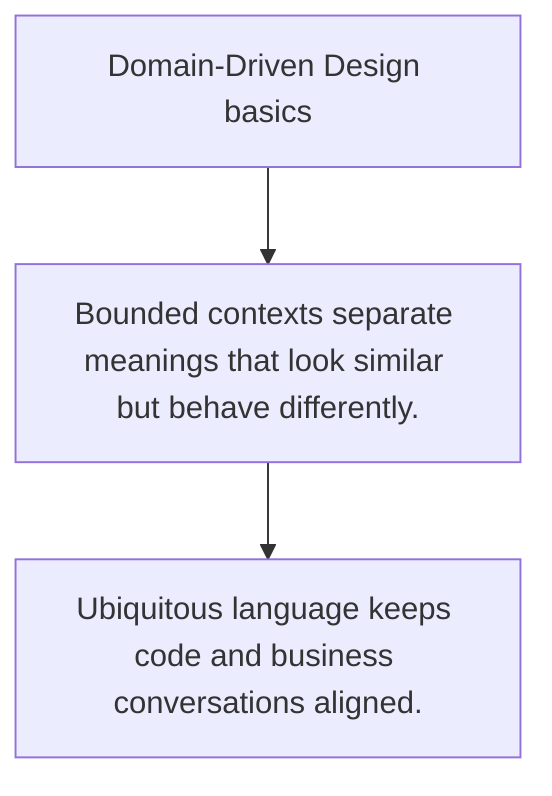

# ARCH.2 Domain-Driven Design basics

## Mission

Learn the boundary language behind domains, aggregates, and bounded contexts.

## Prerequisites

- ARCH.1

## Mental Model

DDD is mainly a naming and boundary discipline, not a folder structure gimmick.

## Visual Model



## Machine View

The goal is to let code and teams talk about the same business concepts without overloaded names.

## Run Instructions

```bash
go run ./09-architecture/03-architecture-patterns/2-ddd-basics
```

## Code Walkthrough

### Bounded contexts separate meanings that look similar b

Bounded contexts separate meanings that look similar but behave differently.

### Entities, value objects, and aggregates organize domai

Entities, value objects, and aggregates organize domain rules.

### Ubiquitous language keeps code and business conversati

Ubiquitous language keeps code and business conversations aligned.

## Try It

1. Change one of the example inputs and rerun the lesson.
2. Explain which boundary the lesson is trying to make explicit.
3. Describe how you would apply ARCH.2 in a small service or tool.

## ⚠️ In Production

DDD becomes useful when the domain is complex enough that language mismatches create real implementation mistakes.

## 🤔 Thinking Questions

1. What problem does this topic solve?
2. What breaks if this boundary is handled implicitly instead of explicitly?
3. Where would you expect to use this topic in production Go code?

## Next Step

Continue to `ARCH.3`.
