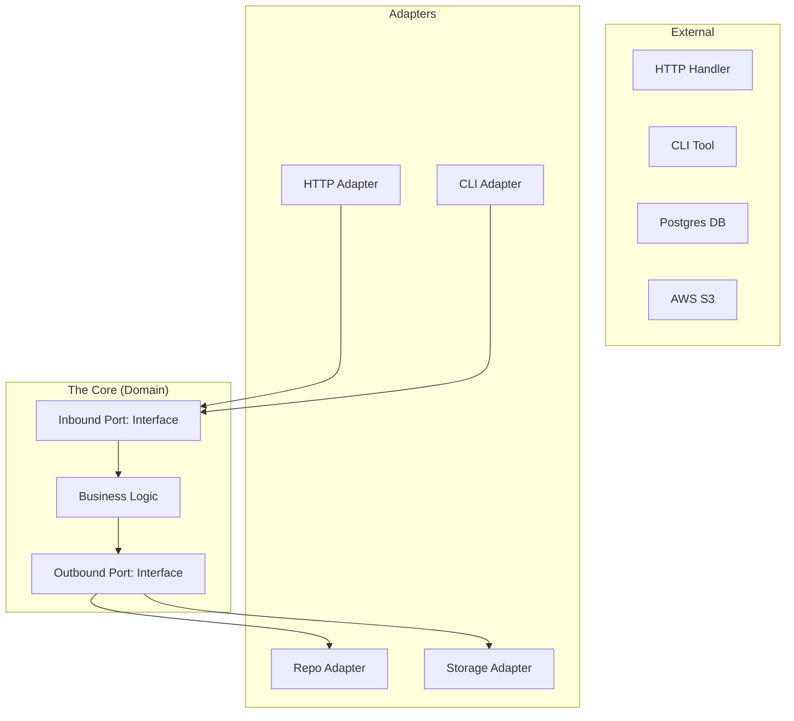

# ARCH.3 Hexagonal Architecture (Ports and Adapters)

## Mission

Master Hexagonal Architecture (also known as Ports and Adapters). Learn how to isolate your core business logic from external concerns like HTTP, gRPC, Databases, and Messaging. Understand how this decoupling makes your code easier to test, maintain, and evolve over time.

## Prerequisites

- ARCH.2 Domain-Driven Design basics
- TE.7 Interfaces for Testability

## Mental Model

Think of Hexagonal Architecture as **A Modern Smartphone**.

1. **The Core**: The smartphone's Operating System and Apps (Business Logic).
2. **The Ports**: The standardized sockets (USB-C, Bluetooth, Wi-Fi). These are interfaces that define *how* to talk to the core.
3. **The Adapters**: The physical devices you plug in (a charger, headphones, a smart TV). They translate their specific signals into the standard port format.
4. **The Benefit**: You can swap your headphones (Adapter) without changing the music app (Core). You can switch from charging via a wall outlet to a power bank without the phone knowing the difference.

## Visual Model



## Machine View

- **Inbound Ports**: Interfaces that the Core implements (or handlers that call the Core).
- **Outbound Ports**: Interfaces that the Core *defines* and *calls*.
- **Dependency Inversion**: The Core never depends on an Adapter. The Adapter depends on the Core's Port. This keeps the center of your application pure Go code with zero external library dependencies.

## Run Instructions

```bash
# Run the demo to see how the Core remains unaware of the storage implementation
go run ./09-architecture/03-architecture-patterns/3-hexagonal-architecture-in-go
```

## Code Walkthrough

### The Domain Core
Contains the business logic and the Port interfaces. It has no imports from `net/http` or `database/sql`.

### The Adapters
Implementation of a "Memory Store" and a "Postgres Store" (simulated). Both satisfy the same Outbound Port, proving the Core doesn't care about the physical storage.

## Try It

1. Look at `main.go`. Identify the Inbound Port and the Outbound Port.
2. Add a new "File Storage" adapter. Plug it into the Core without changing a single line of domain logic.
3. Try to add a `fmt.Println` to the Core. Discuss: Why do some teams consider even the `fmt` package to be an "external dependency" that shouldn't be in the Core?

## In Production
**Don't build a hexagon for a simple script.** Hexagonal architecture adds boilerplate (interfaces, translation logic). Use it for **Long-lived Services** where you expect the technology stack (database, API framework) to change over the next 5 years, or where you need high testability of complex rules.

## Thinking Questions
1. Why is the "Dependency Arrow" always pointing towards the Core?
2. What is the difference between an "Inbound" and an "Outbound" port?
3. How does this architecture simplify Unit Testing?

## Next Step

One of the most common ports is for data storage. Learn how to master that specific boundary. Continue to [ARCH.4 Repository pattern - deep dive](../4-repository-pattern-deep-dive).
