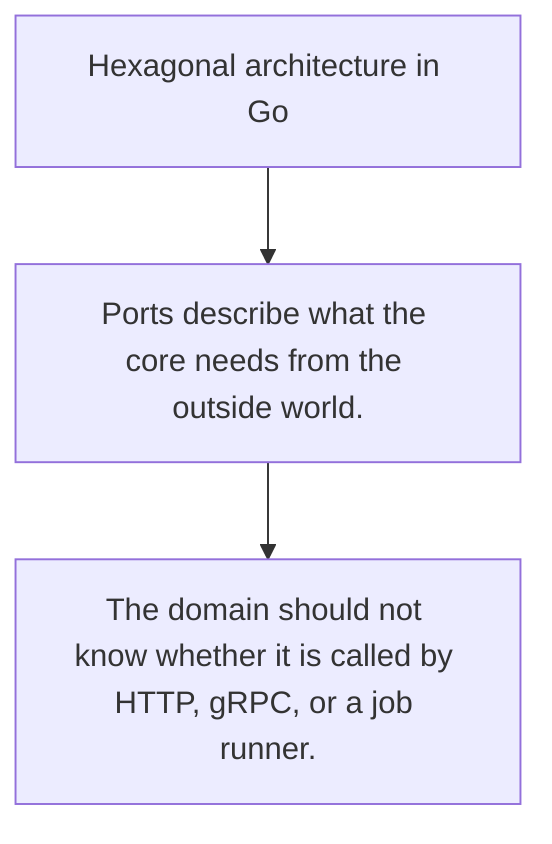

# ARCH.3 Hexagonal architecture in Go

## Mission

Learn how ports and adapters keep domain rules independent of transport and storage details.

## Prerequisites

- ARCH.2

## Mental Model

Hexagonal architecture isolates the core from delivery and persistence concerns through explicit ports.

## Visual Model



## Machine View

The domain talks to interfaces. Adapters satisfy those interfaces at the edges.

## Run Instructions

```bash
go run ./09-architecture/03-architecture-patterns/3-hexagonal-architecture-in-go
```

## Code Walkthrough

### Ports describe what the core needs from the outside wo

Ports describe what the core needs from the outside world.

### Adapters translate external details into the port cont

Adapters translate external details into the port contract.

### The domain should not know whether it is called by HTT

The domain should not know whether it is called by HTTP, gRPC, or a job runner.

## Try It

1. Change one of the example inputs and rerun the lesson.
2. Explain which boundary the lesson is trying to make explicit.
3. Describe how you would apply ARCH.3 in a small service or tool.

## ⚠️ In Production

The value of hexagonal design is not the shape of the diagram. It is the ability to change boundaries without rewriting domain logic.

## 🤔 Thinking Questions

1. What problem does this topic solve?
2. What breaks if this boundary is handled implicitly instead of explicitly?
3. Where would you expect to use this topic in production Go code?

## Next Step

Continue to `ARCH.4`.
