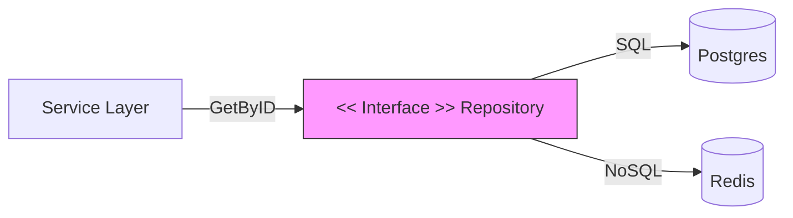

# ARCH.4 Repository Pattern (Deep Dive)

## Mission

Master the Repository Pattern to manage data persistence. Learn how to create an abstraction that looks like an "In-Memory Collection of Aggregates," hiding the complexity of SQL queries, ORM mapping, and database connections from your business logic.

## Prerequisites

- ARCH.3 Hexagonal Architecture

## Mental Model

Think of a Repository as **A Librarian**.

1. **The Request**: You ask the librarian: "I need the book 'The Go Engineer'." (Domain request).
2. **The Retrieval**: The librarian goes into the dark, complex basement (The Database), navigates the aisles (Tables), uses a ladder (SQL Join), and finds the book.
3. **The Result**: The librarian hands you the book. You don't care if the basement has high ceilings, uses a specific indexing system, or if the librarian had to talk to three different assistants. You just have the book.

## Visual Model



## Machine View

- **Domain-Oriented API**: A repository should have methods like `FindActiveUsers()` or `SaveOrder()`, not generic methods like `ExecuteSQL()`.
- **Mapping**: The repository is responsible for converting Database Rows (raw bytes/strings) into Domain Entities (Go structs with business rules).
- **Transaction Management**: In advanced Go patterns, the repository often works with a "Unit of Work" to ensure multiple changes happen atomically.

## Run Instructions

```bash
# Run the demo to see the repository abstraction in action
go run ./09-architecture/03-architecture-patterns/4-repository-pattern-deep-dive
```

## Code Walkthrough

### The "Anemic" Repository (Anti-pattern)
Shows a repository that just wraps SQL. If you change a column name, you have to change both the DB and the Service. This is a sign of a bad abstraction.

### The "Domain" Repository
Shows a repository that returns a fully-formed Aggregate. The Service doesn't know about SQL or database drivers.

## Try It

1. Look at `main.go`. Identify where the SQL mapping happens.
2. Add a new field to the `User` entity (e.g., `LastLogin`). Update the repository to handle this new field without changing the Service's `Find()` call.
3. Discuss: If you use an ORM (like GORM), do you still need a Repository pattern?

## In Production
**Don't create a repository for every table.** Create a repository for every **Aggregate Root**. If an `Order` has many `Items`, you don't need an `ItemRepository`. You should access `Items` through the `OrderRepository`. This maintains the consistency rules defined in your Domain (ARCH.2).

## Thinking Questions
1. Why should a repository interface be defined in the Domain layer?
2. How do you handle "Pagination" in a Repository pattern?
3. What is the difference between a "Repository" and a "Data Access Object (DAO)"?

## Next Step

Now that you've isolated data, learn how to coordinate complex business flows. Continue to [ARCH.5 Service layer pattern](../5-service-layer-pattern).
