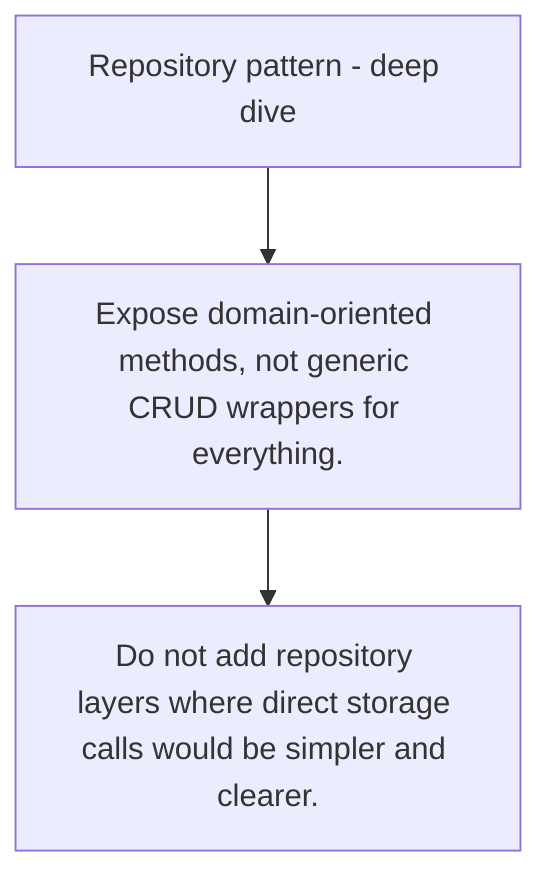

# ARCH.4 Repository pattern - deep dive

## Mission

Learn what the repository pattern is for and where it becomes over-abstraction instead of useful design.

## Prerequisites

- ARCH.3

## Mental Model

A repository boundary should model domain retrieval and persistence needs, not simply mirror a database API.

## Visual Model



## Machine View

Repositories hide storage details so services depend on behavior and data semantics rather than SQL mechanics.

## Run Instructions

```bash
go run ./09-architecture/03-architecture-patterns/4-repository-pattern-deep-dive
```

## Code Walkthrough

### Expose domain-oriented methods, not generic CRUD wrapp

Expose domain-oriented methods, not generic CRUD wrappers for everything.

### Keep transactions and query intent clear at the bounda

Keep transactions and query intent clear at the boundary.

### Do not add repository layers where direct storage call

Do not add repository layers where direct storage calls would be simpler and clearer.

## Try It

1. Change one of the example inputs and rerun the lesson.
2. Explain which boundary the lesson is trying to make explicit.
3. Describe how you would apply ARCH.4 in a small service or tool.

## ⚠️ In Production

Repositories earn their keep when storage choices or complex mapping concerns would otherwise leak everywhere.

## 🤔 Thinking Questions

1. What problem does this topic solve?
2. What breaks if this boundary is handled implicitly instead of explicitly?
3. Where would you expect to use this topic in production Go code?

## Next Step

Continue to `ARCH.5`.
