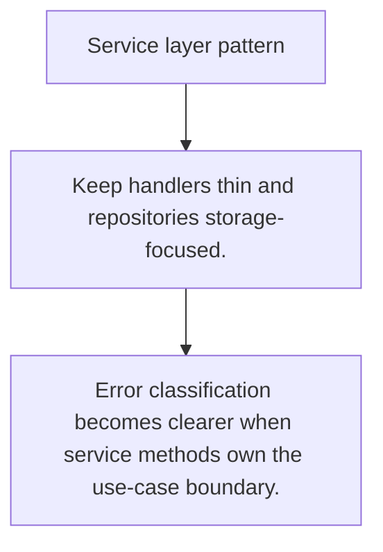

# ARCH.5 Service layer pattern

## Mission

Learn how service layers coordinate domain operations, error handling, and side effects above repositories.

## Prerequisites

- ARCH.4

## Mental Model

A service layer owns use-case orchestration across multiple dependencies.

## Visual Model



## Machine View

Handlers should translate transport; repositories should translate storage; services should coordinate business work.

## Run Instructions

```bash
go run ./09-architecture/03-architecture-patterns/5-service-layer-pattern
```

## Code Walkthrough

### Keep handlers thin and repositories storage-focused.

Keep handlers thin and repositories storage-focused.

### Services coordinate domain behavior across dependencie

Services coordinate domain behavior across dependencies.

### Error classification becomes clearer when service meth

Error classification becomes clearer when service methods own the use-case boundary.

## Try It

1. Change one of the example inputs and rerun the lesson.
2. Explain which boundary the lesson is trying to make explicit.
3. Describe how you would apply ARCH.5 in a small service or tool.

## ⚠️ In Production

Service layers are where cross-entity rules, retries, and error classification often belong.

## 🤔 Thinking Questions

1. What problem does this topic solve?
2. What breaks if this boundary is handled implicitly instead of explicitly?
3. Where would you expect to use this topic in production Go code?

## Next Step

Continue to `ARCH.6`.
