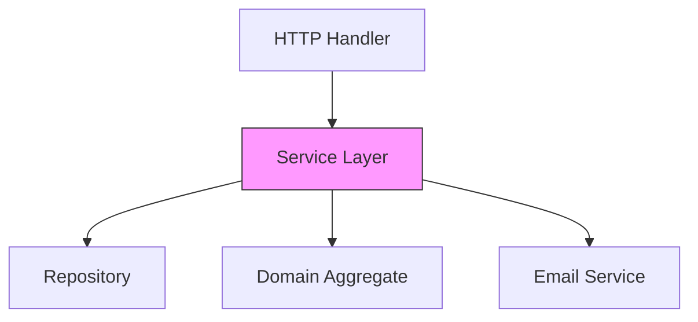

# ARCH.5 Service Layer Pattern

## Mission

Master the Service Layer to coordinate complex business use cases. Learn how to separate your application's "Orchestration" logic (what happens and in what order) from your "Domain" logic (the specific business rules) and your "Transport" logic (HTTP/gRPC details).

## Prerequisites

- ARCH.4 Repository Pattern

## Mental Model

Think of a Service Layer as **An Orchestrator or a Project Manager**.

1. **The Request**: A customer calls the office (The HTTP Handler).
2. **The Coordination**: The Project Manager (The Service) takes the call. They don't do the actual work themselves. Instead, they call the Librarian (Repository) to get data, call the Accountant (Domain Aggregate) to verify a rule, and call the Shipping Clerk (External API) to send a package.
3. **The Response**: Once everyone has finished their task, the Project Manager tells the office worker to tell the customer: "Your order is complete."

## Visual Model



## Machine View

- **"Thin" Handlers**: Your HTTP handlers should only do 3 things: parse input, call a service, and format the response. Zero business logic.
- **Transaction Boundary**: The Service Layer is usually where a database transaction starts and ends.
- **Use Case Focus**: Service methods should be named after real business use cases (e.g., `RegisterUser`, `CheckOutCart`), not technical ones (`UpdateUserTable`).

## Run Instructions

```bash
# Run the demo to see how the service coordinates multiple dependencies
go run ./09-architecture/03-architecture-patterns/5-service-layer-pattern
```

## Code Walkthrough

### The "Fat" Handler (Anti-pattern)
Shows an HTTP handler that directly calls the database, validates an email, and sends a notification. This code is impossible to test without a web server and a real database.

### The Service Orchestrator
Shows how the same logic is moved into a `UserService` struct. This service can be tested by mocking the repository and the email service (TE.8).

## Try It

1. Look at `main.go`. Identify a task that involves multiple dependencies.
2. Add a new service method `SuspendUser(id)`. This method should fetch the user from the repository, mark them as inactive in the domain, save them back to the repository, and log the action.
3. Discuss: What happens if the repository save fails? Who is responsible for "Rolling back" the domain change?

## In Production
**Don't create a Service Layer for simple "Pass-through" code.** If your service method just calls `repo.Save(user)` and nothing else, you might not need the service layer yet. Add it when you need to coordinate **two or more** things (e.g., DB + Cache, DB + Email, or two different DBs).

## Thinking Questions
1. Should a service method accept an `http.Request`?
2. How does the service layer help with "Separation of Concerns"?
3. Where should you handle "Access Control" (e.g., checking if a user has permission to do something)?

## Next Step

Sometimes, coordination needs to happen *after* a task is finished. Learn how to decouple components even further. Continue to [ARCH.6 Event-driven architecture](../6-event-driven-architecture).
