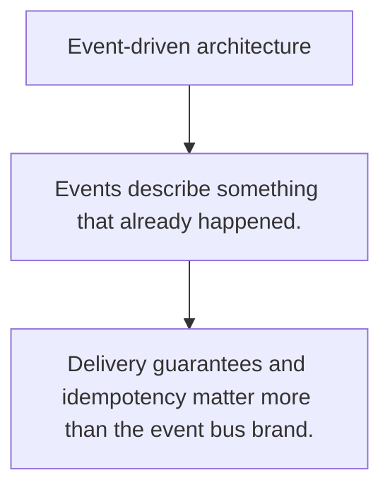

# ARCH.6 Event-driven architecture

## Mission

Learn the benefits and failure modes of publishing domain events instead of wiring every side effect inline.

## Prerequisites

- ARCH.5

## Mental Model

Events decouple producers from consumers by letting one change be observed by many subscribers later.

## Visual Model



## Machine View

Async boundaries trade immediate coupling for delivery guarantees, ordering questions, and observability demands.

## Run Instructions

```bash
go run ./09-architecture/03-architecture-patterns/6-event-driven-architecture
```

## Code Walkthrough

### Events describe something that already happened.

Events describe something that already happened.

### Publishers should not need to know every consumer.

Publishers should not need to know every consumer.

### Delivery guarantees and idempotency matter more than t

Delivery guarantees and idempotency matter more than the event bus brand.

## Try It

1. Change one of the example inputs and rerun the lesson.
2. Explain which boundary the lesson is trying to make explicit.
3. Describe how you would apply ARCH.6 in a small service or tool.

## ⚠️ In Production

Event-driven designs help when many downstream reactions exist, but they demand discipline around idempotency and debugging.

## 🤔 Thinking Questions

1. What problem does this topic solve?
2. What breaks if this boundary is handled implicitly instead of explicitly?
3. Where would you expect to use this topic in production Go code?

## Next Step

Continue to `ARCH.7`.
