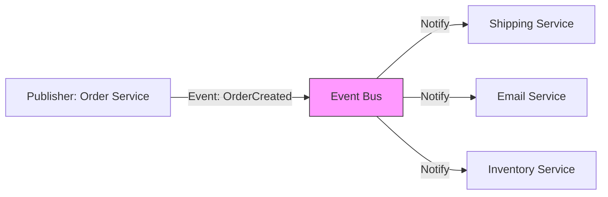

# ARCH.6 Event-Driven Architecture (EDA)

## Mission

Master Event-Driven Architecture to build decoupled and scalable systems. Learn the difference between **Commands** (intent) and **Events** (facts), and understand how to use an **Event Bus** to allow multiple services to react to the same action without tight coupling.

## Prerequisites

- ARCH.5 Service Layer Pattern
- Section 07: Concurrency (Channels and Pub/Sub)

## Mental Model

Think of EDA as **A Social Media Announcement**.

1. **The Event (Fact)**: You post a photo: "I am at the beach!" (This is a fact. It already happened).
2. **The Publisher**: You are the publisher. You don't know (or care) who sees it.
3. **The Consumers**: Your friends (Subscribers) see the post. One friend "Likes" it (Notification Service). One friend adds it to their "Travel" board (Analytics Service). One friend sends you a message (Engagement Service).
4. **The Decoupling**: You didn't have to call each friend individually to tell them you were at the beach. You just announced it once.

## Visual Model



## Machine View

- **Async Boundary**: Events are usually processed asynchronously (in the background). The publisher doesn't wait for the consumers to finish.
- **At-Least-Once Delivery**: Most event systems guarantee the event will be delivered *at least once*. This means your consumers must be **Idempotent** (handling the same event twice shouldn't cause a bug).
- **Domain Events**: In Go, these are often just structs that are passed through channels or sent to a message broker like NATS, RabbitMQ, or Kafka.

## Run Instructions

```bash
# Run the demo to see the Pub/Sub pattern in action
go run ./09-architecture/03-architecture-patterns/6-event-driven-architecture
```

## Code Walkthrough

### The Event Bus
A simple in-memory implementation using Go channels. It allows components to `Subscribe` to specific event types and `Publish` events to them.

### Decoupled Components
Shows an `OrderService` that publishes an event. A `BillingService` and a `ShippingService` react to that event without the `OrderService` knowing they exist.

## Try It

1. Look at `main.go`. Identify the publisher and the two subscribers.
2. Add a third subscriber: a `LoyaltyService` that gives the user points when an `OrderCreated` event is published.
3. Modify the `BillingService` to fail randomly. Notice how the `OrderService` (the publisher) is unaffected by the failure.

## In Production
**Don't use EDA for simple, synchronous workflows.** Events make debugging harder because the execution path is not a single linear stack trace. Use EDA when you have **Side Effects** that don't need to happen immediately (e.g., sending emails, updating search indexes, or notifying other microservices).

## Thinking Questions
1. What is the difference between a "Command" and an "Event"?
2. What happens to the system if the Event Bus crashes?
3. How do you handle "Order of Operations" (e.g., ensuring Shipping only happens *after* Billing)?

## Next Step

Next: `ARCH.7` -> `09-architecture/03-architecture-patterns/7-cqrs-basics`

Open `09-architecture/03-architecture-patterns/7-cqrs-basics/README.md` to continue.
