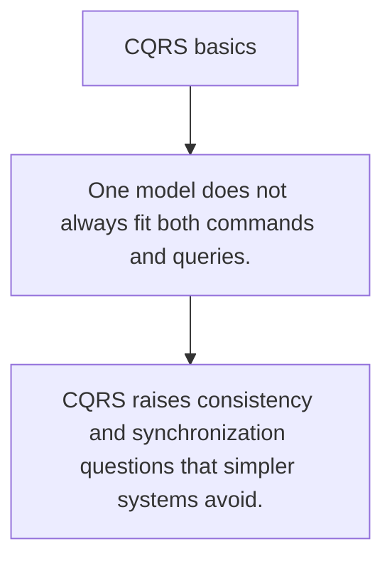

# ARCH.7 CQRS basics

## Mission

Learn when separating write models from read models improves a system and when it is needless complexity.

## Prerequisites

- ARCH.6

## Mental Model

CQRS separates commands from queries when one model cannot serve both jobs well.

## Visual Model



## Machine View

Different read and write shapes can make heavy reporting or write-heavy domains easier to evolve.

## Run Instructions

```bash
go run ./09-architecture/03-architecture-patterns/7-cqrs-basics
```

## Code Walkthrough

### One model does not always fit both commands and querie

One model does not always fit both commands and queries.

### Read models often optimize different access patterns t

Read models often optimize different access patterns than write models.

### CQRS raises consistency and synchronization questions 

CQRS raises consistency and synchronization questions that simpler systems avoid.

## Try It

1. Change one of the example inputs and rerun the lesson.
2. Explain which boundary the lesson is trying to make explicit.
3. Describe how you would apply ARCH.7 in a small service or tool.

## ⚠️ In Production

CQRS is a useful tool only when the read/write mismatch is real enough to justify the extra moving parts.

## 🤔 Thinking Questions

1. What problem does this topic solve?
2. What breaks if this boundary is handled implicitly instead of explicitly?
3. Where would you expect to use this topic in production Go code?

## Next Step

Continue to `ARCH.8`.
