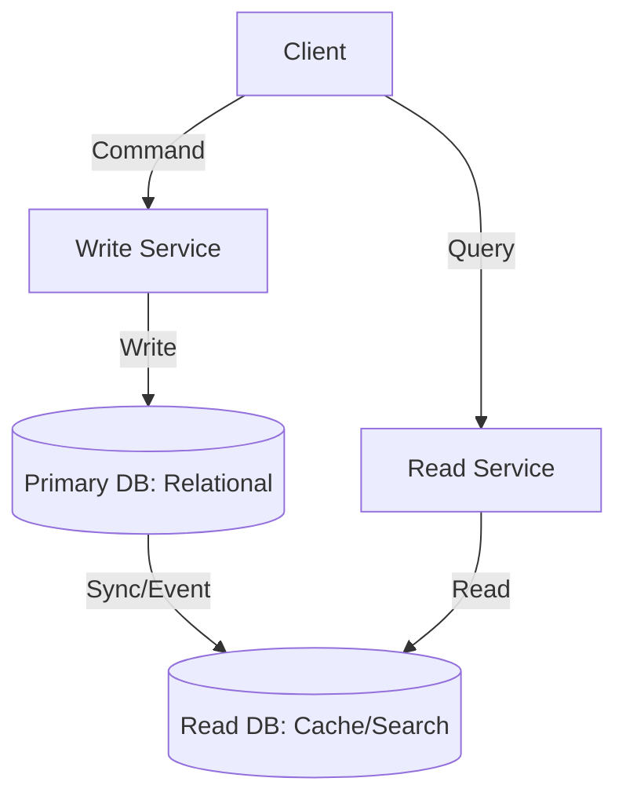

# ARCH.7 CQRS Basics

## Mission

Master the Command Query Responsibility Segregation (CQRS) pattern. Learn how to separate your "Write" logic (Commands) from your "Read" logic (Queries) to build systems that can scale these two different workloads independently.

## Prerequisites

- ARCH.6 Event-Driven Architecture

## Mental Model

Think of CQRS as **A Restaurant's Menu vs. The Chef's Recipe**.

1. **The Command (The Chef's Recipe)**: This is the Write side. It's complex, highly detailed, and designed for *action*. It has all the ingredients and precise instructions to make the food. (The Database Aggregate).
2. **The Query (The Menu)**: This is the Read side. It's simple, formatted for the customer, and designed for *speed*. It doesn't tell you how the food is made; it just shows the name, price, and a photo. (A Read Model).
3. **The Segregation**: You don't hand the customer a 20-page technical recipe. You hand them a 1-page menu. They are two different models of the same data.

## Visual Model



## Machine View

- **Command**: Changes the state of the system. Returns nothing (or just a success/fail ID).
- **Query**: Returns data. Does *not* change the state of the system.
- **Eventual Consistency**: When the Write side changes, it might take a few milliseconds (or seconds) for the Read side to update. This is the trade-off for high read performance.

## Run Instructions

```bash
# Run the demo to see how Read and Write models differ
go run ./09-architecture/03-architecture-patterns/7-cqrs-basics
```

## Code Walkthrough

### The Write Model (Command)
A struct with complex validation rules and business logic for processing an "Order." It is optimized for correctness.

### The Read Model (Query)
A flat, simple struct optimized for a "Recent Orders" dashboard. It doesn't have any validation logic; it's just a view of the data.

## Try It

1. Look at `main.go`. Identify the "Command" handler and the "Query" handler.
2. Add a new field `Status` to the Write model. Observe how you have to manually update the Read model to reflect this change.
3. Discuss: Why might you use a different database (e.g., Elasticsearch) for the Read side while keeping the Write side in Postgres?

## In Production
**Don't use CQRS for everything.** It adds significant complexity because you have to keep the two models in sync. Start with a single model. Only introduce CQRS when your read queries are getting too slow/complex (e.g., huge SQL Joins) or when your read and write scaling needs are vastly different.

## Thinking Questions
1. Why does CQRS often go hand-in-hand with Event-Driven Architecture?
2. What is "Task-Based UI," and how does it relate to Commands?
3. Can you have CQRS *without* having two separate databases?

## Next Step

Next: `ARCH.8` -> `09-architecture/03-architecture-patterns/8-when-to-split-services`

Open `09-architecture/03-architecture-patterns/8-when-to-split-services/README.md` to continue.
