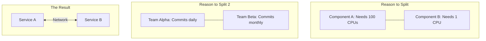

# ARCH.8 When to Split Services

## Mission

Learn how to identify the "Tipping Point" where a Monolith should be split into multiple services. Understand the valid reasons for splitting (Scaling, Team Autonomy, Fault Isolation) and the invalid ones (Hype, Premature Optimization).

## Prerequisites

- ARCH.1 Monolith vs. Microservices
- ARCH.7 CQRS Basics

## Mental Model

Think of Splitting Services as **Dividing a Growing Restaurant**.

1. **The Shared Kitchen**: At first, one kitchen handles everything. It's efficient.
2. **The Problem**: Eventually, the "Bakery" needs its own specialized ovens and 24/7 staff, while the "Pizza" section only runs at dinner. They are getting in each other's way.
3. **The Split**: You move the Bakery to the building next door.
4. **The Cost**: Now you have two rents, two sets of managers, and you have to drive the bread over to the pizza shop every morning (Network latency).
5. **The Justification**: You only do this if the *benefit* of the Bakery's independence is greater than the *cost* of the extra rent and driving.

## Visual Model



## Machine View

- **Resource Contention**: If one part of your app consumes all the RAM, it can starve other parts. Splitting them allows for independent resource limits (Docker/K8s).
- **Deployment Cadence**: If Team A wants to deploy 10 times a day but Team B needs a 2-week QA cycle, a monolith will slow down Team A.
- **Data Gravity**: Sometimes data must reside in a specific region or database for compliance reasons, forcing a service split.

## Run Instructions

```bash
# Run the demo to simulate scaling and coordination costs
go run ./09-architecture/03-architecture-patterns/8-when-to-split-services
```

## Code Walkthrough

### The "Heavy" Component
Simulates a component that uses significant CPU/Memory. In a monolith, this impacts every other component.

### The "Independent" Service
Shows how the heavy component can be moved behind a network boundary, allowing it to be scaled up (using more replicas) without scaling the rest of the application.

## Try It

1. Run the demo. Compare the "Monolith" response time with the "Microservice" response time (which includes network overhead).
2. Increase the "Load" on the heavy component. Watch how the Monolith's other features begin to slow down.
3. Discuss: If you have a team of 3 developers, is "Team Autonomy" a valid reason to split a service?

## In Production
**Splitting is easy; Joining is hard.** Once you split a service, you've introduced "Distributed System Problems" (network failures, data consistency, complicated tracing). Only split when the pain of the monolith (slow deploys, resource starvation, team friction) is clearly visible in your metrics.

## Thinking Questions
1. What is "Conway's Law," and how does it relate to service boundaries?
2. How does a "Service Mesh" (like Istio) help manage a large number of split services?
3. What is the difference between a "Service" and a "Package"?

## Next Step

Next: `ARCH.9` -> `09-architecture/03-architecture-patterns/9-modular-refactor-exercise`

Open `09-architecture/03-architecture-patterns/9-modular-refactor-exercise/README.md` to continue.
