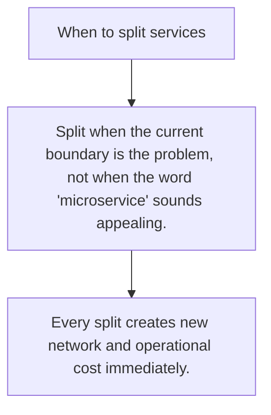

# ARCH.8 When to split services

## Mission

Learn the signals that justify service boundaries and the anti-signals that only imitate architecture maturity.

## Prerequisites

- ARCH.7

## Mental Model

Split services because one boundary is costing too much, not because distributed systems sound advanced.

## Visual Model



## Machine View

A service split changes deployment, ownership, data flow, and failure recovery all at once.

## Run Instructions

```bash
go run ./09-architecture/03-architecture-patterns/8-when-to-split-services
```

## Code Walkthrough

### Split when the current boundary is the problem, not wh

Split when the current boundary is the problem, not when the word 'microservice' sounds appealing.

### Look for sustained pressure in deploy cadence, ownersh

Look for sustained pressure in deploy cadence, ownership, or scaling needs.

### Every split creates new network and operational cost i

Every split creates new network and operational cost immediately.

## Try It

1. Change one of the example inputs and rerun the lesson.
2. Explain which boundary the lesson is trying to make explicit.
3. Describe how you would apply ARCH.8 in a small service or tool.

## ⚠️ In Production

The best split is one backed by clear pressure: team autonomy, scaling profile, fault isolation, or compliance.

## 🤔 Thinking Questions

1. What problem does this topic solve?
2. What breaks if this boundary is handled implicitly instead of explicitly?
3. Where would you expect to use this topic in production Go code?

## Next Step

Continue to `ARCH.9`.
