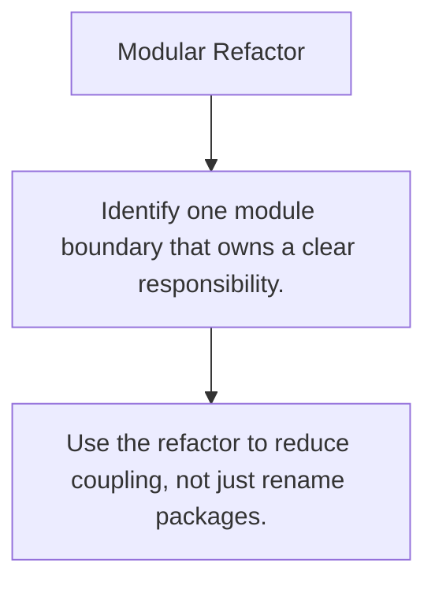

# ARCH.9 Modular Refactor

## Mission

Refactor a tangled application shape into clearer modules with explicit boundaries and collaboration points.

## Prerequisites

- ARCH.1
- ARCH.2
- ARCH.3
- ARCH.4
- ARCH.5
- ARCH.6
- ARCH.7
- ARCH.8

## Mental Model

Refactoring architecture means tightening ownership and dependency direction, not just moving files around.

## Visual Model



## Machine View

The exercise proves whether earlier design ideas can survive contact with a realistic module boundary change.

## Run Instructions

```bash
go run ./09-architecture/03-architecture-patterns/9-modular-refactor-exercise
```

## Solution Walkthrough

- Identify one module boundary that owns a clear responsibility.
- Make dependency direction explicit between modules.
- Use the refactor to reduce coupling, not just rename packages.

## Verification Surface

- Use `go run ./09-architecture/03-architecture-patterns/9-modular-refactor-exercise`.
- Starter path: `09-architecture/03-architecture-patterns/9-modular-refactor-exercise/_starter`.

## Try It

1. Change one of the example inputs and rerun the lesson.
2. Explain which boundary the lesson is trying to make explicit.
3. Describe how you would apply ARCH.9 in a small service or tool.

## ⚠️ In Production

Architecture work matters only when the resulting system is easier to change, reason about, and test.

## 🤔 Thinking Questions

1. What problem does this topic solve?
2. What breaks if this boundary is handled implicitly instead of explicitly?
3. Where would you expect to use this topic in production Go code?

## Next Step

Use this lesson as a reference surface before moving to the next track in the section.
