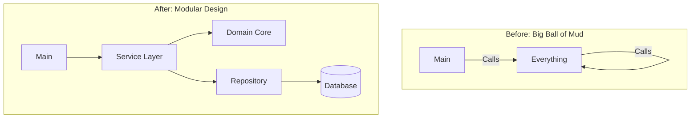

# ARCH.9 Modular Refactor Exercise

## Mission

Put your architecture knowledge into practice. Take a "Tangled Monolith" (Big Ball of Mud) and refactor it into a **Modular Monolith**. You will identify domain boundaries, extract logic into services and repositories, and use interfaces to decouple components.

## Prerequisites

- Complete ARCH.1 through ARCH.8.

## Mental Model

Think of this refactor as **Untangling Headphone Wires**.

1. **The Knot**: Right now, the code is a mess. The database logic is mixed with HTTP logic, and every part of the app knows about every other part.
2. **The Identification**: You find the ends of the wires (The Domain Boundaries).
3. **The Extraction**: You carefully pull one wire out at a time, making sure it only connects to the things it *needs* to (The Interfaces).
4. **The Result**: You have a clean, organized set of modules that can be moved or changed without tangling the others.

## Visual Model



## Machine View

- **Code Structure**: You will move code from a single `main.go` into multiple packages like `internal/user`, `internal/billing`, and `internal/db`.
- **Interface Seams**: You will replace direct struct dependencies with interfaces to allow for mocking and independent testing.

## Run Instructions

```bash
# Run the starter code (it works, but it's messy)
go run ./09-architecture/03-architecture-patterns/9-modular-refactor-exercise/_starter

# Run the tests to verify your refactored code
go test ./09-architecture/03-architecture-patterns/9-modular-refactor-exercise
```

## Solution Walkthrough

1. **Analyze**: Open `_starter/main.go`. Identify the business logic, the database calls, and the HTTP handlers.
2. **Extract Domain**: Create a `domain.go` (or a sub-package) for the core entities and their business rules.
3. **Extract Repository**: Create a `repository.go` for the database logic. Use an interface.
4. **Extract Service**: Create a `service.go` to coordinate the logic.
5. **Clean the Handler**: Update the HTTP handlers to only call the Service.
6. **Verify**: Ensure the code still runs and passes the provided tests.

## Try It

1. Can you refactor the code so that the `Billing` logic doesn't know about the `User` database table?
2. Introduce a "Mock" repository in your test file and prove that the service works without a real database.
3. (Challenge) Add an "Event" that is published when a user is refactored, and subscribe to it from a separate module.

## Verification Surface

- Use `go test ./09-architecture/03-architecture-patterns/9-modular-refactor-exercise/...`.
- Starter path: `09-architecture/03-architecture-patterns/9-modular-refactor-exercise/_starter`.


## In Production
**Refactor with a goal.** Don't refactor just for "Clean Code." Refactor because you need to add a new feature that is currently too hard to implement, or because your tests are too slow and brittle. Refactoring without a goal is "Gold Plating" and can introduce bugs without delivering value.

## Thinking Questions
1. What was the hardest part of untangling the dependencies?
2. How did using interfaces change the way you wrote your tests?
3. If you had to split this app into microservices tomorrow, how much work would it be now vs. before the refactor?

## Next Step

Next: `SEC.1` -> `09-architecture/04-security/1-input-validation-patterns`

Open `09-architecture/04-security/1-input-validation-patterns/README.md` to continue.
