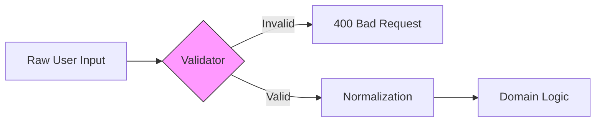

# SEC.1 Input Validation Patterns

## Mission

Master the "Trust but Verify" principle of security. Learn how to use **Allow-lists**, **Normalization**, and **Fail-fast Checks** to ensure that every piece of data entering your system is safe, valid, and exactly what your business logic expects.

## Prerequisites

- None (Foundational concept).

## Mental Model

Think of Input Validation as **A High-Security Border Checkpoint**.

1. **The Passport Control (Allow-list)**: We don't ask: "Are you a criminal?" (Deny-list). We ask: "Do you have a valid passport from a country we trust?" (Allow-list). If it's not on the list, you don't get in.
2. **The Scanner (Normalization)**: We don't just look at the suitcase. we run it through an X-ray to make sure everything inside is in a standard, safe format. (e.g., converting "  Admin  " to "admin").
3. **The Immediate Rejection (Fail-fast)**: If you don't have a passport, we turn you away *at the gate*. We don't let you into the country and then check your passport at the hotel.

## Visual Model



## Machine View

- **Allow-lists over Deny-lists**: It is impossible to list every "bad" string (SQLi, XSS). It is easy to list the "good" ones (e.g., a regex for an Alphanumeric Username).
- **Early Rejection**: Validate in the HTTP handler or the first line of the Service Layer. Never let invalid data reach the database.
- **Type Safety**: Use Go's type system. Instead of passing a `string` everywhere, create an `Email` or `UserID` type that validates itself upon creation.

## Run Instructions

```bash
# Run the demo to see validation patterns in action
go run ./09-architecture/04-security/1-input-validation-patterns
```

## Code Walkthrough

### The "Naive" Validation (Anti-pattern)
Shows code that uses a `switch` statement to check for a few "bad characters." This is easily bypassed by attackers.

### The "Allow-list" Pattern
Shows how to use Regex and Length checks to strictly define what a valid "Username" looks like.

### Normalization
Demonstrates trimming whitespace and converting to lowercase before processing, which prevents "Shadow Accounts" (e.g., "admin" vs "Admin").

## Try It

1. Look at `main.go`. Try to bypass the current validation by adding a special character like `%` or `;`.
2. Add a validation rule for a "Zip Code" (exactly 5 digits).
3. Discuss: Should you return a detailed error message to the user ("Password must contain a symbol") or a generic one ("Invalid input")?

## In Production
**Validation is not just for the UI.** Never trust the front-end. An attacker will bypass your JavaScript and send raw POST requests directly to your API. Always validate on the **Server Side**. Use established libraries like `ozzo-validation` or `go-playground/validator` if your rules are complex, but keep simple checks in plain Go code for performance and clarity.

## Thinking Questions
1. Why is a "Deny-list" (Blacklist) almost always a security risk?
2. What is the difference between "Validation" and "Sanitization"?
3. How does input validation protect against SQL Injection?

## Next Step

Next: `SEC.2` -> `09-architecture/04-security/2-sql-injection-prevention`

Open `09-architecture/04-security/2-sql-injection-prevention/README.md` to continue.
