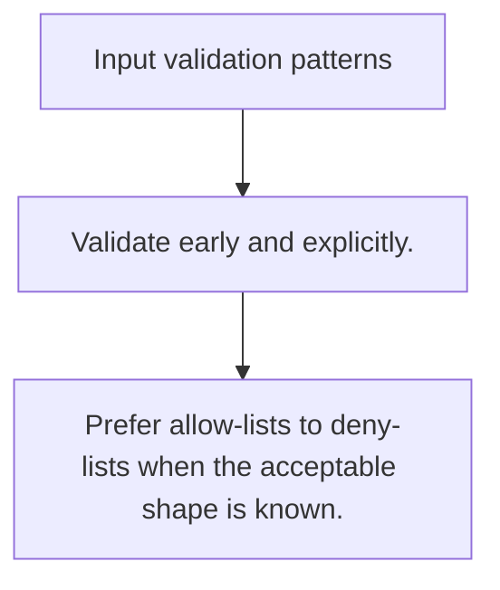

# SEC.1 Input validation patterns

## Mission

Learn how allow-lists, normalization, and fail-fast checks turn raw input into trustworthy domain values.

## Prerequisites

- none

## Mental Model

Validation is boundary work that decides whether input is acceptable before business logic depends on it.

## Visual Model



## Machine View

The closer invalid input is rejected to the edge, the fewer parts of the system need to defend against it later.

## Run Instructions

```bash
go run ./09-architecture/04-security/1-input-validation-patterns
```

## Code Walkthrough

### Validate early and explicitly.

Validate early and explicitly.

### Normalize data before deeper rules depend on it.

Normalize data before deeper rules depend on it.

### Prefer allow-lists to deny-lists when the acceptable s

Prefer allow-lists to deny-lists when the acceptable shape is known.

## Try It

1. Change one of the example inputs and rerun the lesson.
2. Explain which boundary the lesson is trying to make explicit.
3. Describe how you would apply SEC.1 in a small service or tool.

## ⚠️ In Production

Treat validation as a first-class engineering concern because every public boundary is a security boundary.

## 🤔 Thinking Questions

1. What problem does this topic solve?
2. What breaks if this boundary is handled implicitly instead of explicitly?
3. Where would you expect to use this topic in production Go code?

## Next Step

Continue to `SEC.2`.
