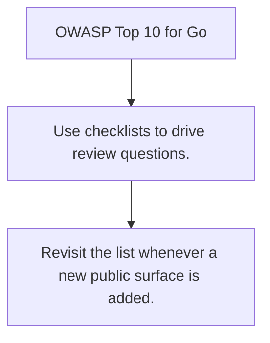

# SEC.10 OWASP Top 10 for Go

## Mission

Turn the OWASP Top 10 into a practical checklist for Go services and review conversations.

## Prerequisites

- SEC.9

## Mental Model

The OWASP list is a prioritization aid, not a complete security strategy.

## Visual Model



## Machine View

The value of a checklist is that it keeps high-probability failure modes visible during design and review.

## Run Instructions

```bash
go run ./09-architecture/04-security/10-owasp-top-10-for-go
```

## Code Walkthrough

### Use checklists to drive review questions.

Use checklists to drive review questions.

### Map common risks to concrete Go boundary decisions.

Map common risks to concrete Go boundary decisions.

### Revisit the list whenever a new public surface is adde

Revisit the list whenever a new public surface is added.

## Try It

1. Change one of the example inputs and rerun the lesson.
2. Explain which boundary the lesson is trying to make explicit.
3. Describe how you would apply SEC.10 in a small service or tool.

## ⚠️ In Production

Security checklists matter most when they are embedded into normal engineering work instead of living in a forgotten audit document.

## 🤔 Thinking Questions

1. What problem does this topic solve?
2. What breaks if this boundary is handled implicitly instead of explicitly?
3. Where would you expect to use this topic in production Go code?

## Next Step

Continue to `SEC.11`.
